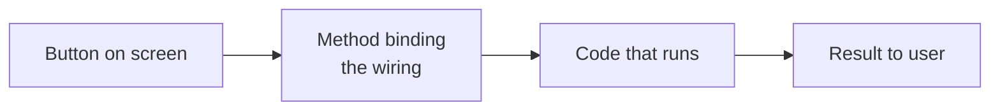
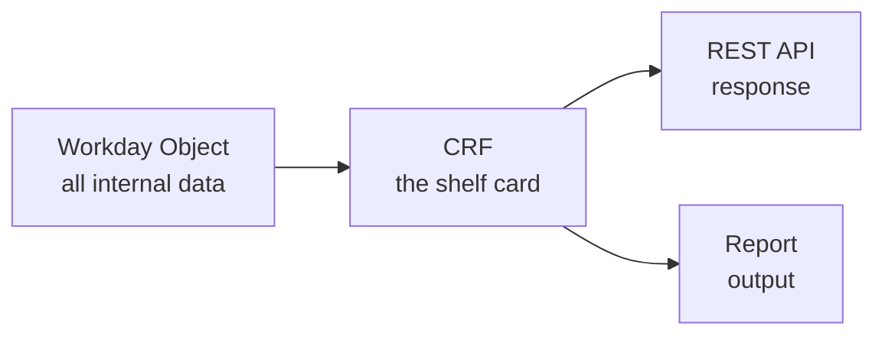
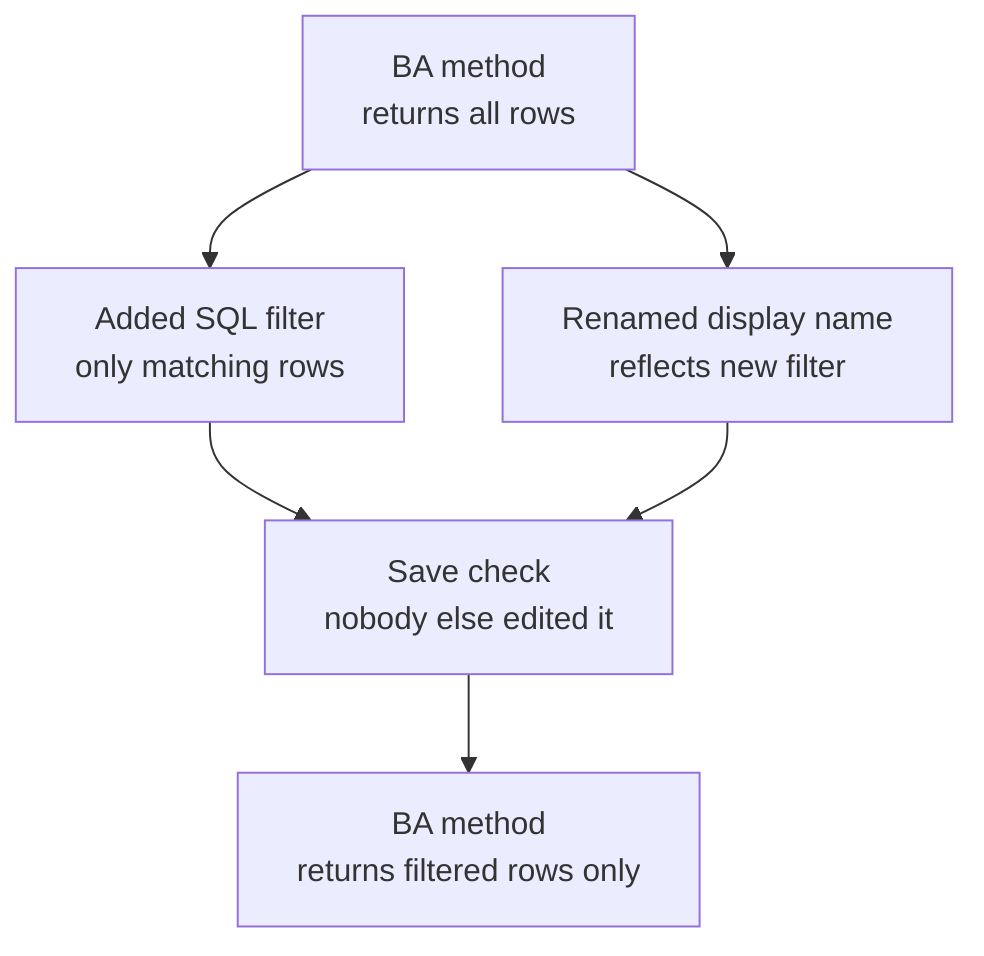

# Teachable Moment

Plain-English explanations for a non-technical Product Manager. This skill is **globally available** - any agent, any context. It is **read-only**: it never runs tool calls, never writes to the SUV, never modifies code or config.

## When to Use This Skill

Trigger when the user:

- Types `/teachable-moment <concept>` or `/teachable-moment` (no argument).
- Says "teach me about [X]", "explain [X] simply", "what is [X]", "what does [X] mean".
- Says "explain that simply", "PM version of your last response", "break that down", "I don't follow".
- Signals confusion mid-flow: "I don't understand", "that's too technical", "can you explain this differently", or goes quiet after a dense technical response.

Agents (especially `@xo-developer`) should **proactively offer** `/teachable-moment` after any response that used 3+ technical terms.

## Two Invocation Shapes

### Shape 1 - Concept lookup

User provides a concept to explain. Examples:
- `/teachable-moment method binding`
- "Teach me about WQL"
- "Explain EBE methods simply"
- "What is a Build Attribute?"

Explain the concept from scratch using the six-part response structure below. The user has no prior context.

### Shape 2 - Re-explain last response

User wants the most recent assistant response re-framed in plain English. Examples:
- `/teachable-moment` (no argument)
- "Explain that simply"
- "PM version of your last response"
- "Break that down"

Reread the most recent assistant response in the conversation. Identify the 1-3 concepts that made it technical. Re-explain the whole response using the six-part response structure below, substituting the core concepts in place of where they appeared.

If the last response didn't contain anything technical, say so plainly: "That last response was already in plain English - nothing to translate. Did you want a `/teachable-moment` on a specific concept instead?"

## Response Structure (Every Invocation)

Use this six-part structure. Do not skip parts; do not reorder them. Keep each part tight. The diagram in part 2 is the visual anchor for a visual-learner PM - render it *before* the analogy so the shape of the concept lands before the words do.

### 1. One-line definition

Plain English, no jargon. If a technical term is unavoidable, gloss it in parentheses in five words or fewer.

Example:
> A **method binding** is the piece of Workday that connects a button to the code that runs when you click it.

### 2. Diagram (Mermaid)

One Mermaid diagram, rendered inline. Cursor renders Mermaid natively in markdown, so this costs nothing, takes no time, and always works. The diagram is the visual anchor for a visual-learner PM - it should let them *see* the shape of the concept in a glance, before the analogy and deeper text.

**Pick the diagram type to fit the concept:**

- **`flowchart LR` / `flowchart TD`** - default choice; use for "input -> thing -> output" or "before -> after" concepts (e.g. method binding, CRF, a patch flow).
- **`mindmap`** - use for concept decomposition where there's a central idea with 3-5 facets (e.g. "what is a BA method" with branches for expression, displayName, versionToken).
- **`sequenceDiagram`** - use for interaction concepts with multiple actors (e.g. "how does a button click reach the database").
- **Class-like `flowchart`** - use for object relationships and parent/child structure (e.g. BO vs CRF vs Representation Content).

**Rules:**

- Exactly **one diagram per response**. Not two, not zero.
- **3-8 nodes maximum.** More than 8 becomes too dense to scan in 30 seconds.
- **Plain-English node labels**, 1-4 words each. No raw WIDs or IIDs. Avoid Workday-specific jargon in labels where a plain word works (say "object" not "BO", say "save check" not "versionToken", unless the jargon term is itself what the PM asked about).
- If the concept genuinely does not diagram well, fall back to a 3-node `mindmap` listing the three most important facts - do not force an awkward flowchart.
- Respect Cursor's Mermaid syntax constraints: no spaces in node IDs (use camelCase or underscores); quote any label containing parentheses, brackets, or colons (`A["Process (main)"]`); avoid reserved IDs (`end`, `subgraph`, `graph`, `flowchart`); no explicit `style` / `classDef` / colours (they break dark mode); no HTML entities; no `click` events.
- **No code comments inside the diagram.** The diagram is the answer, not a tutorial.

Example:

### 3. Analogy

Non-technical, drawn from everyday life. Prefer: filing cabinet, restaurant kitchen, airport luggage system, power socket, library card catalogue, postal address, supermarket checkout. Avoid: any analogy that requires knowing another technical concept to understand this one. Where possible, make the analogy reinforce the shape shown in the diagram above.

Example:
> Think of it like the wiring behind a light switch. The switch on the wall (the button) is useless on its own - the wiring (the method binding) is what connects it to the light bulb (the code that actually does the work).

### 4. Why a PM should care

Concrete product or user impact. What decisions does this concept touch? What should a PM be able to ask about it?

Example:
> As a PM, you care about method bindings because they decide what happens when a user clicks your feature's buttons. If a binding is wrong, the click does nothing, or runs the wrong thing. Most "button doesn't work" bugs trace back to a binding issue, not the button itself.

### 5. What could go wrong

Risk framing the PM can action. Not doom-mongering - practical "if this breaks, here's what users see" or "if you skip this, here's the trap".

Example:
> If a method binding points to the wrong code, users see the button work but get the wrong result (e.g. clicking "Save" actually submits). If the binding is missing entirely, the button appears grey or unresponsive. Both look like UI bugs but are actually backend wiring.

### 6. Follow-up questions to explore next

Suggest 2-3 natural follow-ups the PM could ask to build on this one. Frame as `/teachable-moment` prompts the PM could copy-paste.

Example:
> Want to go deeper? Try:
> - `/teachable-moment what's the difference between BA and EBE methods`
> - `/teachable-moment how do I know if a binding is broken`
> - `/teachable-moment what's an instance ID vs a WID`

## Escape Hatch

End every response with a standing offer for more depth - so the PM knows they can go deeper without having to find the right words:

> Want the engineering detail on any of this?

If the PM says yes, drop the six-part structure and give a more technical explanation - but still translate jargon and check in after dense chunks. You can keep the diagram if it still helps; otherwise omit it in favour of code/precise prose.

## Hard Rules

- **Read-only.** Never run tool calls (no XO MCP, no X2 MCP, no Pharos, no Tableau). Never write to files except your own response. Never modify SUV state.
- **No code blocks unless necessary.** If code helps, include it - but explain every line above it in plain English first. Never dump a code block as the answer.
- **No raw WIDs or IIDs in explanations.** If you must reference a specific object, use its display name with the ID in parentheses. A raw `f06f1890d6ca100039aa1c137e620000` means nothing to a PM.
- **Concrete over abstract.** Every explanation should be anchored to something the PM can point at in Workday UI, or a user-visible behaviour. Pure abstraction ("it's a kind of metadata-driven dispatcher") fails this skill.
- **30-second test.** If the whole response takes longer than 30 seconds to read, it's too long. Trim.
- **One analogy per concept.** Multiple analogies confuse more than they clarify. Pick the best one.
- **One Mermaid diagram per response.** See the Diagram section for type selection and rules. The diagram is mandatory, not optional - a visual-learner PM relies on it. If a concept truly resists diagramming, use a 3-node `mindmap` of the three most important facts rather than skipping.
- **Honesty about limits.** If the concept is genuinely complex and the PM will need engineering depth to act on it, say so: "The short version is [X]. If you're making a decision that depends on this, I'd recommend pairing this with a live chat with Rachel / Kit / Allan, because the trade-offs matter more than the concept does."

## Non-Goals

- Not a tutorial generator. If a PM wants to learn XO end-to-end, route them to Contexto's `/help` or a training resource, not a string of `/teachable-moment` calls.
- Not a code explainer. For "what does this line of code do", a narrower tool (or the agent that wrote the code) is better.
- Not a fact-checker. If a PM asks "is X true about Workday", this skill explains X; it doesn't verify X against live Workday state.
- Not a replacement for `@xo-developer` advisory. Advisory behaviours give decision guidance; `/teachable-moment` gives conceptual grounding. They pair; they don't overlap.

## Example (Shape 1, concept lookup)

**User**: `/teachable-moment CRF`

**Skill**:

> A **CRF** (Class Report Field) is a piece of data a Workday object exposes so that REST APIs and reports can use it.

> Think of it like the product information card on a supermarket shelf. The product itself (the Workday object) has loads of internal details the shopper never sees. The shelf card picks out just the bits that matter - name, price, allergens - and displays them in a consistent format. A CRF is the shelf card: it decides what the outside world gets to see about an object.
>
> As a PM, you care about CRFs because they're what shows up in your REST API responses and reports. If a field is missing from the API, it's almost always because there's no CRF for it. Adding a field to your API usually means creating a new CRF.
>
> If a CRF has the wrong data type, consumers of your API get type errors or display the data wrongly. If a CRF is exposed when it shouldn't be, you've leaked internal data. If a CRF is missing, the API response is incomplete and users can't complete their workflow.
>
> Want to go deeper? Try:
> - `/teachable-moment how is a CRF different from a regular field`
> - `/teachable-moment what's a Representation Content`
> - `/teachable-moment when would I need a new CRF vs reuse an existing one`
>
> Want the engineering detail on any of this?

## Example (Shape 2, re-explain)

**Previous assistant response**:
> "I've patched the BA method's expression to include the SQL filter `C5633_29790 as planning_staffing_status_id = fromInstanceId('4477$2')` and updated its displayName via `ba_method_patch` with the captured versionToken."

**User**: `/teachable-moment`

**Skill**:

> Plain-English version of what I just did:
>
> A **BA method** is a piece of code in Workday that fetches data from the database - think of it like a saved query that other parts of Workday can re-run.

> I changed two things on the one you pointed me at:
> 1. The **expression** (the actual query it runs) - I added a filter so it only returns rows where the planning status matches a specific value you picked.
> 2. The **displayName** (what it's called in Workday's UI) - I renamed it so the new name reflects the new filter.
>
> The `versionToken` thing is just a safety check Workday uses to make sure nobody else edited the method between the moment I read it and the moment I saved my change. Think of it like a "are you sure you have the latest version?" prompt. I passed it through, so the save went cleanly.
>
> Want to go deeper? Try:
> - `/teachable-moment what's a BA method vs an EBE method`
> - `/teachable-moment what is a versionToken and why does it matter`
> - `/teachable-moment how do I know which method to change for a given filter`
>
> Want the engineering detail on any of this?
