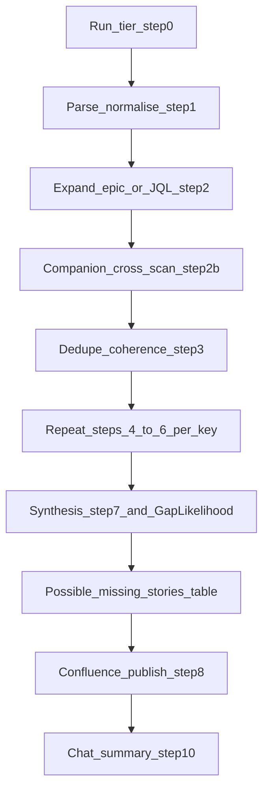

# Net-new story gap review

You help a **non-technical Senior Workday Recruiting Product Manager** prepare
for build by surfacing **gaps in upcoming work** (net-new stories): missing
journeys, edge cases, precedent from internal knowledge, **what engineering may need to confirm** (XO metadata + optional codebase signals in plain English),
tenant/product realism, and **suggested missing BDD (Given/When/Then)** scenarios
that would exercise or close those gaps—written as **plain-language, actionable suggestions**
(not jargon dumps). **Source of truth:** Jira fields + user prompt (including
attachments). Do **not** auto-resolve external PRDs.

**Audience lock (mandatory):** All three lens columns speak **to the PM as the reader**—recommendations and questions you can take to refinement or a short alignment with engineering, **not** an engineering ticket dump. Prefer **recruiter / admin / candidate** wording; when a technical term is unavoidable, add **one short clause in the same sentence** on why it matters to hiring (e.g. “**XO** (product configuration metadata) did not show a named hook for …—ask engineering whether …”). The **Dev lens** column is **for you**: it should answer “**What should I ask engineering to confirm before we size or build this?**” without stacks of class names, raw paths, or unexplained acronyms.

**From-scratch contract:** When the user asks to **run** this skill (including
`/user-story-gap-review`), treat it as a **new review**, not a refresh of prior
artefacts. Do **not** reuse PM/QA/Dev prose from an earlier Confluence revision,
from static row libraries in repo generators, or from prior chat summaries as a
substitute for **this run’s** MCP evidence. **Each story** in scope must be
grounded in **fresh** Jira ingest + Salomon + **Dev lens evidence** (**XO MCP** read-only; **Peanut MCP** only when triggers in [`reference.md`](reference.md) **When to invoke Peanut (2WE per-row)**) + DA for this execution (see
[`reference.md`](reference.md)). Batched or theme-first passes are allowed for
efficiency but must still yield **story-specific** cells.

**Three personas (all must be deliberately critical):** each story gets
**Product (PM)**, **Quality (QA)**, and **Dev lens** (engineering adjacency: **XO MCP** for product metadata on the SUV, plus **Peanut MCP** only when **When to invoke Peanut (2WE per-row)** in [`reference.md`](reference.md) applies—similar issues / narrow repo signals translated for a non-technical PM).
They intentionally stress **different dimensions**—slice value and missing
journeys; edge cases and testability; **feasibility, integration touchpoints, and “what we could not verify from metadata or repo read-only tools.”** **Salomon and DA inform PM and QA** (see
[`reference.md`](reference.md)); they are **not** separate table columns. The goal is **constructive tension**: when they disagree, that tension should surface in **Verdict** and **Suggested missing BDD** (and thus in **Gap Likelihood**)—not by scoring PM vs QA vs **Dev lens** directly in column **2** (see [`reference.md`](reference.md) **Gap column (2)** and **Gap likelihood — per story (Verdict + BDD)**).

**Operator quick path:** (1) Default **Tier A** unless the user or limits force **Tier B** (disclose in exec summary **preface**). (2) Live publish: **Gap Likelihood** = Confluence **Status** lozenge per [`reference.md`](reference.md) **Gap likelihood — per story (Verdict + BDD)**—assign **after** **Verdict** and **Suggested missing BDD** for each row (**no** `%`). (3) Before Confluence: `python3 -m py_compile` on any edited formatter; regenerate HTML; `python3 docs/initiatives/two-way-email/drafts/check_gap_review_row_dedup.py <file.html> [--threshold 4]`. (4) After editing [`reference.md`](reference.md), [`reference-companion-whatsapp.md`](reference-companion-whatsapp.md), or [`SKILL.md`](SKILL.md): `python3 scripts/verify_user_story_gap_review_skill_contract.py` (must exit 0). (5) One `smart_update_confluence_page` **`replace`** when under ~90k chars; else **sequential** `append` chunks only. (6) Rolling page **4416121176** unless the user names another `pageId`.

**Progressive disclosure:** **Contents** (TOC) at the top of [`reference.md`](reference.md); **WhatsApp companion (013 / 2WE)** full contract in [`reference-companion-whatsapp.md`](reference-companion-whatsapp.md); table HTML, **Gap Likelihood** rubric, thin-spec rules,
batching, epic-level checks, audience tone, prompt preambles, **run tiers (Tier A / Tier B)**,
and the **Publish pipeline** live in [`reference.md`](reference.md).

## Flow (schematic)

*Schematic only—authoritative steps, optional paths, and edge cases live in **Workflow** below and in [`reference.md`](reference.md).*



**Per-key block (steps 4–6):** Jira ingest → thin-spec gate → Dev lens evidence (Salomon + XO MCP + **Peanut only when gated** + Deployment Agent)—see [`reference.md`](reference.md) **When to invoke Peanut (2WE per-row)**. **Step 2b** is mandatory for **HRREC-82977** unless the user opts out; optional companion scope otherwise—details in [`reference-companion-whatsapp.md`](reference-companion-whatsapp.md).

## Inputs

1. **Prompt text** — Extract keys with `[A-Z]+-\d+`. Accept user-supplied JQL
   strings, epic keys, "similar to HRREC-nnnn", Confluence `spaceKey`, and page
   preferences.
2. **Attachments** (.csv, .xlsx, .pdf) — Extract keys with the same regex;
   dedupe.

If no keys and no JQL, ask for at least one key or JQL.

## Workflow (checklist)

0. **Run tier** — Default **Tier A** (full contract per [`reference.md`](reference.md) **Run tiers**). Use **Tier B** only if the user asks for a timeboxed / fast epic sweep or if you must declare Tier B due to hard time/token limits—then the **Tier B disclosure must appear in the executive-summary preface** (≤2 short items before **Top 5 gaps**—exact pattern in **Run tiers** / **Page structure**). Never silently downgrade. **Subset / smoke / local-only:** if the user tests a **subset** of keys, asks for a **smoke** pass, or does not want to touch the default rolling page, follow [`reference.md`](reference.md) **Subset / smoke / local-only runs**—state **Run scope** and **Publish target** in the preface; do **not** `replace` the default rolling `pageId` **4416121176** with a **partial** table unless the user **explicitly** confirms that overwrite (otherwise use local HTML, a scratch `pageId`, or ask).
1. **Parse & normalise** — Collect keys; note user extras for Salomon/Jira
   context.
2. **Expand epic** — If the user gives an epic (or a key that is an Epic):
   - Prefer `summarizeJiraEpic` (`user-jira-ghe`) for child inventory, **or**
   - `searchJiraTickets` with JQL such as `"Epic Link" = EPIC-KEY` (project
     custom field names may vary—adjust from `getTicketDetails` / Jira UI if
     the query returns empty).
   - **Stories only** (exclude Task, Spike, RN wrapper, etc.): add
     `issuetype = Story`, e.g.
     `project = HRREC AND issuetype = Story AND "Epic Link" = HRREC-82977 ORDER BY key ASC`.
     `summarizeJiraEpic` lists all linked types; use this JQL when the PM
     restricts scope to Story.
   - **Doc-writer exclusions:** drop any issue whose **Summary** starts with
     **`AG:`** or **`RN:`** (case-insensitive) from the gap-review table and from
     per-row MCP work—see [`reference.md`](reference.md). List skipped keys in chat.
   - For raw JQL only, run `searchJiraTickets` and collect keys from results
     (paginate with `startAt` as needed).
   - Optional advanced path: `executeApi` for uncaptured Jira REST (see MCP
     descriptor).
2b. **Companion channel cross-scan (013 / 2WE)** — **Mandatory** when the run is **HRREC-82977** / two-way email scope (including subset/smoke on keys under that epic) **unless** the user explicitly **opts out** with a phrase listed in [`reference-companion-whatsapp.md`](reference-companion-whatsapp.md) **When to run**; **optional** for other gap-review scopes unless the user asks for WhatsApp / companion patterns. **When step 2b runs**, corpus rules are **mandatory** unless the user explicitly **narrows scope** (see companion doc). **Before** dedupe/synthesis of the **2WE (or primary) in-scope keys**, build **this run’s** WhatsApp evidence—canonical epics: [`docs/initiatives/two-way-email/COMPANION_WHATSAPP_EPICS.md`](../../../docs/initiatives/two-way-email/COMPANION_WHATSAPP_EPICS.md). **Choose path** (see **Manifest-only**, **Live delta with snapshot**, and **Full live corpus** in [`reference-companion-whatsapp.md`](reference-companion-whatsapp.md)):
   - **Manifest-only (default when eligible):** [`docs/initiatives/two-way-email/reference/WHATSAPP_COMPANION_CORPUS_SNAPSHOT.md`](../../../docs/initiatives/two-way-email/reference/WHATSAPP_COMPANION_CORPUS_SNAPSHOT.md) satisfies snapshot **eligibility** in [`reference-companion-whatsapp.md`](reference-companion-whatsapp.md) **and** the user did **not** ask for **`WhatsApp live delta`**, **`WhatsApp refresh corpus`**, **`WhatsApp live-only`**, or **`ignore WhatsApp snapshot`**. Read the snapshot (manifest + **Captured excerpts**) only—**no** WhatsApp Jira MCP (`summarizeJiraEpic`, `searchJiraTickets`, `getTicketDetails` for companion keys). Corpus line per [`reference-companion-whatsapp.md`](reference-companion-whatsapp.md) (**Manifest-only**).
   - **Live delta with snapshot (opt-in):** User asks for **`WhatsApp live delta`** or **`WhatsApp refresh corpus`** and snapshot **eligibility** holds—then follow [`reference-companion-whatsapp.md`](reference-companion-whatsapp.md) **Live delta with snapshot** (Jira delta + `getTicketDetails` for new keys, etc.).
   - **Full live (fallback):** User requests **`WhatsApp live-only`** / **`ignore WhatsApp snapshot`**, or snapshot preconditions fail (missing file, **`manifest_complete: false`**, empty manifest). **Required unless the user narrows scope:** (1) For **each** companion epic, `searchJiraTickets` with `issuetype in (Story, Bug)` scoped to that epic; **paginate** `startAt` until all issues are collected. (2) **`getTicketDetails`** for **every** unique key from that inventory. (3) Optionally `summarizeJiraEpic` per epic to reconcile counts—document mismatches in the companion Confluence `h2`.
   - **Tracking:** For each path, follow **Companion partial corpus / resume** in [`reference-companion-whatsapp.md`](reference-companion-whatsapp.md) so partial runs stay honest.
   - **Parallel:** for **≈18+** WhatsApp keys needing **`getTicketDetails`** (**full live** or **live delta with snapshot** only), shard across **`Task` / `generalPurpose`** subagents (disjoint key lists); parent merges—**never** parallel Confluence writes.
   - **Do not** add WhatsApp issues as **rows** in the seven-column table unless the user explicitly scopes them. **Do not** run Salomon / XO / Peanut / DA **across the full** WhatsApp manifest unless the user **widens scope** or invokes a **Companion Peanut anchor pass** (see [`reference-companion-whatsapp.md`](reference-companion-whatsapp.md) **Optional Peanut**): then **only** **3–8** named anchor keys and **`user-peanut-mcp`** read-only calls per that section—still **no** Salomon / XO / DA per WhatsApp key unless widened. Publish the companion **`h2`** + **corpus line** per [`reference-companion-whatsapp.md`](reference-companion-whatsapp.md). During step **7**, **≤1** **`Cross-channel (WhatsApp backlog) —`** bullet per **2WE** row when a theme from the corpus plausibly applies. If the anchor pass ran, also emit **`h3` Code evidence (WhatsApp anchors—Peanut)** per [`reference-companion-whatsapp.md`](reference-companion-whatsapp.md).
3. **Dedupe, epic coherence & cap** — Unique keys; warn above ~12 stories; chunk per
   [`reference.md`](reference.md). When the run is an **epic** or a coherent **JQL
   set**, add an **epic-level** synthesis (plain-language bullets in the page body,
   not only per-row): overlapping or **duplicated scenarios** across stories;
   **obvious holes** (e.g. send without receive, purge without logging);
   **ordering / dependency** risks; candidate **missing story types** the PM should
   confirm (e.g. no spike for a known platform unknown). This is cross-story
   synthesis, not a second Jira query unless the user asks.
4. **Per story — ingest (this run only)** — Primary:
   `user-jira-ghe` / `getTicketDetails` with `{ "jiraTicket": "KEY" }`. Fallback:
   `user-salomon-jira` / `jira_details_tool` with `{ "issue_key": "KEY",
   "max_comments": 20 }`. **Always pull current Jira text in this session** for
   each key in scope—do not reuse bodies from a prior gap-review page or static
   generator file as the source of truth.
5. **Thin-spec gate** — Apply thresholds in [`reference.md`](reference.md);
   tag row if insufficient.
6. **Dev lens evidence** (per story, after ingest) — **MCP outputs are merged in
   step 7; there are no separate Salomon/DA columns in Confluence:**
   - **Salomon KB** — `user-salomon-internal-knowledge` /
     `search_workday_internal_knowledge` — under **Tier A**, **2–3** `message` queries per story with **net-new**
     preamble from [`reference.md`](reference.md); **each** story needs its own query tie (a single epic-wide batch query does **not** satisfy **Tier A** unless the user has **explicitly** opted into **Tier B**). **Subset / smoke** runs still require a **per-key** Salomon tie for every in-scope row—see [`reference.md`](reference.md) **Subset / smoke / local-only runs**. Under **Tier B**, use documented **theme** queries plus per-row honest **Salomon —** lines (see **Run tiers**). Use hits to flag **product
     patterns, constraints, and precedent** (→ **PM lens**) and **past bugs,
     failure modes, support-style risks** (→ **QA lens**).
   - **XO MCP (read-only)** — `user-xo-mcp` / `search` (and optionally
     `hopper_search`, `service_description_get`, `business_logic_get` when
     relevant). **No** writes, REST execution, or binding execution. Synthesise into the **Dev lens** column with **`XO MCP —`** tagged bullets (plain English for the PM reader).
   - **Peanut MCP (`user-peanut-mcp`)** — **Part of the Dev lens**, not a fourth table column. **Default: do not call** `collectBugData` / `searchCode` for this row. Invoke **only** when triggers in [`reference.md`](reference.md) **When to invoke Peanut (2WE per-row)** match (user asked for repo depth; Jira shows integration/regression/repo hooks; or **`XO MCP — risk:`** needs a narrow “did code move here?” check)—then **≤1–2** read-only calls under **Tier A**. **Tier B:** default **no** per-row `collectBugData`; use **`Peanut — Not queried — timeboxed / no trigger`** per row unless the user widens scope or one epic-scoped batch was agreed in chat. Use **Peanut — taxonomy (gap review)** in [`reference.md`](reference.md): **Not queried** vs **Unavailable** (tool/config/Jira fetch) vs **Ran — no useful signal** vs narrative signal—**never** conflate fetch errors with “no engineering work yet.” **Never** paste secrets, tokens, or long raw diffs; **paraphrase** into **what the PM should ask engineering**.
   - **Deployment Agent** — `user-deployment-agent` / `ask_deployment_agent`
     with net-new scoped `question`. Batching one answer for many keys is OK; **row-anchored** synthesis is required (see **Deployment Agent — batched answers** in [`reference.md`](reference.md)). Use answers for **tenant setup, limits, and
     how customers actually run Recruiting** (→ **PM lens** for product/config
     boundary) and **operational / test realism** (→ **QA lens**).
7. **Synthesis** — For **each** story, write **Story** (link + summary), **three** lens columns (PM, QA, **Dev lens**), **Verdict**, **Suggested missing BDD (Given/When/Then)** (column **7**), then **Gap Likelihood** (column **2**)—**seven** data columns total (see
   [`reference.md`](reference.md)). Tune for a **non-technical Sr. PM**: plain
   English, **story-specific** bullets (no identical QA/PM paragraphs across
   siblings—epic-wide themes go in the **Executive summary (Top 5 gaps / Top 5 strengths)** or **Epic-level notes** once). **Evidence-first — no fabrication:** every PM/QA/**Dev** bullet, **Verdict** line, and BDD block must be traceable per **Evidence grounding — no fabrication** in [`reference.md`](reference.md) (including, when the companion step ran, a same-row **`Cross-channel (WhatsApp backlog) —`** bullet as the anchor for **Verdict** / column **7** companion synthesis—see **Verdict column** and **Suggested missing BDD — specificity** there). Do **not** invent precedent, tenant facts, or platform hooks to sound thorough. **PM / QA:** every
   bullet starts with a **source tag** (**Jira —**, **Salomon —**, **Deployment Agent —**,
   **Functional knowledge —**, **Other —**; when the **Companion channel cross-scan** ran, you may add **≤1** **Cross-channel (WhatsApp backlog) —** bullet per row (rules in [`reference-companion-whatsapp.md`](reference-companion-whatsapp.md)). Tag rules otherwise per [`reference.md`](reference.md).
   Paraphrase Salomon/DA; do not paste the same internal dump on every row.
   Apply **PM read-aloud gate**, **Lens column brevity** caps, and **Tier B — Salomon / Deployment Agent sentence reuse cap** from [`reference.md`](reference.md) before publish (especially Tier B epic sweeps).
   - **Product (PM) lens** — Who benefits, what is unclear or missing for **this**
     slice, dependencies, rollout/comms. Use tags above; translate jargon (e.g.
     REST → behind-the-scenes save/send vs what the UI shows).
   - **Quality (QA) lens** — What could break for **this** story in real tenants:
     edge cases, negative paths, how a recruiter would notice a defect. Tagged
     Salomon/DA lines must tie to **this** summary, not a generic checklist.
     **Not an automation script:** lead with **what recruiters or candidates would see go wrong**, then how QE might exercise it; follow **QA lens — user-visible risk first** and **PM read-aloud gate** in [`reference.md`](reference.md) (no **Assert** / **Prove** / **Verify** / **Measure** / **Trace** as the first word after the source tag).
   - **Dev lens** — One `<ul>` for the **Dev lens** column: lead with **`XO MCP —`** bullets (what was searched, what was found or not, optional **`XO MCP — risk:`**). Add **`Peanut —`** bullets per [`reference.md`](reference.md) **Peanut — taxonomy (gap review)** when Peanut ran or when honestly **Not queried** / **Unavailable**; **plain-English** implications for **you** when there is a signal (what to ask engineering, what changed recently in code that might affect this slice). Read-only tools only; no SUV writes. If XO was skipped, state that honestly—do not fabricate metadata depth.
   - Draft **Verdict** (column 6): exactly **two** one-sentence bullets—**Finding**
     (TL;DR of the row, **evidence-backed only**) and **Recommended next step**
     (concrete action **or** honest “no material gap” line when appropriate)—see
     [`reference.md`](reference.md). When this row includes **`Cross-channel (WhatsApp backlog) —`** in PM or QA, **Finding** may compress that bullet’s translation tension **with** **2WE** Jira/lens evidence in one sentence; **Recommended next step** may name an email-side refinement—still **no** “WhatsApp bug ⇒ email defect” (see **Verdict column** / **Cross-channel (WhatsApp) synthesis** in [`reference.md`](reference.md)). **No** long numbered question lists.
   - Draft the **Suggested missing BDD** column (column **7**) **before** **Gap Likelihood**: **0–4** scenario blocks per story (**hard cap 4**; **do not pad**—prefer fewer when Jira is strong; see [`reference.md`](reference.md)). **Order for column 7:** re-open the Jira description → extract existing scenario titles / `*Given*` / AC structure → draft **missing** GWT that **complement** what Jira already states → only then gap-fill from PM–QA–**Dev lens** tension. When a **`Cross-channel (WhatsApp backlog) —`** bullet is present, you may add **at most one** **GWT** block that closes its **email translation question** (after higher-priority gaps from Jira vs lenses)—see **Cross-channel companion** in [`reference.md`](reference.md) **Suggested missing BDD — specificity, uniqueness, follow-on**. Column 7 is **additive** to Jira Scenarios, **not** a generic rewrite of the whole story. Each scenario must **trace** to a tension or gap on **that row** (PM vs QA vs **Dev lens** contradiction, XO “not found”, DA/Salomon themes in PM/QA, a **`Cross-channel (WhatsApp backlog) —`** bullet when present, or the same tension captured in **Verdict** / PM–QA)—not a generic epic dump. Follow **Suggested missing BDD — specificity, uniqueness, follow-on** in [`reference.md`](reference.md) (parse-first, banned placeholders, one primary actor per scenario, concrete **When** verbs from the summary or existing scenario titles, no duplicate Given+When across sibling keys). Use plain-language **Given / When / Then** (Storage HTML: `<p>` lines with `<br/>` or nested lists; avoid Markdown `**` in cells). **Thin-spec rows:** follow [`reference.md`](reference.md)—no elaborate GWT trees; at most **1–2** high-level scenarios or a **Blocked until AC exists** framing block.
   - **Gap Likelihood (column 2)** — **After** **Verdict** and **Suggested missing BDD** exist for the row, assign the Confluence **Status** macro using **only** those two outputs per [`reference.md`](reference.md) **Gap likelihood — per story (Verdict + BDD)** (**no** `%`; **no** direct PM/QA/**Dev lens** side-by-side scoring for the lozenge). **Do not** derive labels from ticket hash/modulo/PRNG. **Draft replay HTML** from repo formatters may use heuristics—disclose in preface when those badges are **not** Verdict+BDD judgment; see [`reference.md`](reference.md) **Gap column (2)**.
   - **Replay HTML generators (repo only):** `docs/initiatives/two-way-email/drafts/generate_gap_review_page_82977.py` rebuilds Storage HTML from **frozen** evidence JSON for Confluence size tests—it is **not** a Tier A/B skill substitute. Tier B layout helpers (e.g. `docs/initiatives/two-way-email/drafts/build_gap_review_82977_tier_b_2026-05-15.py`) may emit **Gap Likelihood** **Status** macros from formatter heuristics—label any publish **draft replay** in chat or Confluence when not driven by the live rubric. The **no identical multi-line boilerplate across sibling rows** rule in [`reference.md`](reference.md) still applies when maintaining those scripts. Optional duplicate check before publish: `python3 docs/initiatives/two-way-email/drafts/check_gap_review_row_dedup.py <path/to/gap_review.html>` — flags heavy repetition in **PM, QA, Dev lens, Verdict,** and **Suggested missing BDD** columns on the **main** table and **Reason / BDD** on the holistic table when present (see **Dry-run operator checklist** in [`reference.md`](reference.md)); optional `--threshold 4` for a stricter pass.
   - **Possible missing stories (holistic table)** — **After** the full main-matrix pass (every row’s column **7** drafted), build the **second** table per [`reference.md`](reference.md) **Possible missing stories (holistic suggestions)** only from holistic gaps **not** already captured as that row’s **Suggested missing BDD**; **no** Jira creation; PRD/initiative scope only when loaded per that section.
8. **Confluence** — `user-confluence-mcp` (follow **[`reference.md`](reference.md) → Publish pipeline** for pre-flight size, single `replace` vs sequential chunked `append`, and **no parallel** page updates):
   - **Subset / smoke:** declare whether this run **skips Confluence**, targets a **scratch** `pageId`, or **replace**s the rolling page—see [`reference.md`](reference.md) **Subset / smoke / local-only runs**. Treat “no Confluence URL in chat” as **failure** when the user expected a publish unless you stated **Confluence skipped** up front.
   - **Default rolling page (David’s gap review):** `pageId` **4416121176** —
     `https://confluence.workday.com/pages/viewpage.action?pageId=4416121176` —
     on every **fresh run**, prefer publishing the **entire** new page body with
     `smart_update_confluence_page` **`mode: "replace"`** (full overwrite). Do **not**
     append batches unless MCP/transport limits force the **Publish pipeline** fallback (HTML `<tr>` rows only; include `<!-- gap-review KEY -->` per row for dedupe; **strictly sequential** chunk calls—never parallel Confluence writes).
   - If the user supplies a different `pageId` / URL, use that target with the same
     **replace** semantics when they ask for a rolling overwrite.
   - New page (only when explicitly requested): `create_confluence_page` (`title`,
     `spaceKey`, `content`).
   - **Publish Storage HTML** (`<table>…</table>`) with **seven** columns per
     [`reference.md`](reference.md): Story, column **2** (**Gap Likelihood**—see **Gap column (2)**), PM lens, QA lens, **Dev lens**,
     Verdict, Suggested missing BDD (Given/When/Then). **No** separate Salomon or DA columns.
     Markdown pipe tables often render as plain text in Confluence.
   - **Top of page:** start with the **PM executive summary** exactly as in [`reference.md`](reference.md) **Page structure**—`h2` **Executive summary (for PM)**; optional **preface** `<ul>` (≤2 items: run tier, optional **Gap Likelihood** reader note / **draft replay** caveat, scope); then **`h3` Top 5 gaps (epic)** and **`h3` Top 5 strengths (epic)** (≤5 one-sentence bullets each; gaps before strengths; do not pad). Then **Epic-level notes**; then, **when step 2b ran**, the **Cross-initiative pattern hints (WhatsApp — inspiration only)** `h2` per [`reference-companion-whatsapp.md`](reference-companion-whatsapp.md) **Confluence output**; then the **main** seven-column **Storage HTML** table; then the **Possible missing stories** `h2` + three-column table (or omission `<p>`) per [`reference.md`](reference.md) **Page structure** / **Possible missing stories (holistic suggestions)**.
9. **Optional browsers** — After a successful write, run:
   `bash scripts/open-url-chrome-and-cursor-browser.sh "<final confluence url>"`
   from repo root (skip if the user declines or URL unknown).
10. **Chat summary** — Mirror the **executive summary** (Top 5 gaps + Top 5 strengths headlines, plus preface if material) + link; when the holistic table has rows, add **1–3** short headline themes from **Possible missing stories** (not the full grid); if step **2b** ran with a **partial** WhatsApp corpus, repeat **which epics/keys** were not ingested so a follow-up can resume; for
    large batches, do not paste the full HTML table in chat—link to Confluence.
11. **MISSION_LOG (optional)** — After a successful publish to a rolling gap-review page, append **one line** to **`MISSION_LOG.md`** in the **User-story-gap-review run log** table (date, `pageId`, epic/scope, story count, **Tier A|B**, notes—see that section for the format).

## Sub-agents (when to use)

- **Default:** run **inline** in the invoking agent so epic-level narrative and
  **Gap Likelihood** assignment stay coherent.
- **MCP-bearing subagents only:** Any `Task` that must call **`call_mcp_tool`**
  (Jira, Salomon, XO, Peanut, Deployment Agent, **Confluence**) must use a subagent type
  that has MCP access (e.g. **`generalPurpose`**). **Never** use **`subagent_type: shell`**
  (or shell-only agents) for Confluence publish or Jira/Salomon evidence—those
  sessions **cannot** invoke MCP; work is silently dropped.
- **Consider parallel `Task` subagents** when **≈18+ stories** (2WE scope) **or ≈18+ WhatsApp companion keys** or evidence MCP calls would otherwise serialize for many minutes: e.g. one subagent per **Jira key band** (`…91970–91989`, `…91990–92009`, …) returning **structured JSON**
  (per-key Salomon/XO/Peanut/DA notes + proposed **PM/QA** bullet text); the parent **merges**, applies
  thin-spec gate, drafts **Verdict** and **Suggested missing BDD** per row, assigns **Gap Likelihood** (column **2**) per [`reference.md`](reference.md) **Gap likelihood — per story (Verdict + BDD)**, runs **one** epic-coherence pass, and
  **writes Confluence** with **one** `replace` **or** **sequential** chunked updates per **Publish pipeline**—**never** parallel `smart_update_confluence_page` calls.
- **Optional:** `@xo-developer` Task only when the user asks for **deep XO** (see
  [`reference.md`](reference.md)).

## MCP servers & tools

| Server | Tools | Role |
|--------|--------|------|
| `user-jira-ghe` | `getTicketDetails`, `searchJiraTickets`, `summarizeJiraEpic`, `executeApi` (optional) | Ingest; epic children; JQL |
| `user-salomon-jira` | `jira_details_tool` | Fallback issue body |
| `user-salomon-internal-knowledge` | `search_workday_internal_knowledge` | Precedent / bugs → **merge into PM/QA cells** |
| `user-deployment-agent` | `ask_deployment_agent` | Tenant realism → **merge into PM/QA cells** |
| `user-xo-mcp` | `search` (+ optional `hopper_search`, `service_description_get`, `business_logic_get`) | **Dev lens:** product metadata adjacency on the SUV, read-only |
| `user-peanut-mcp` | `collectBugData`, `searchCode` (+ optional `getCommitSummary`, `getCommitDiff` when justified) | **Dev lens:** similar issues / narrow repo signals—**signal-gated** per [`reference.md`](reference.md) **When to invoke Peanut (2WE per-row)**; **plain-English** paraphrase for the PM; cap calls per **Dev lens** step |
| `user-confluence-mcp` | `search_confluence`, `create_confluence_page`, `smart_update_confluence_page` | Report |

**Dev lens policy:** **XO MCP** is **read-only** (no writes, REST execution, or binding execution). **Peanut** is **read-only** evidence for the same column—**default no `collectBugData`** per row unless [`reference.md`](reference.md) **When to invoke Peanut (2WE per-row)** applies; **no** pasting credentials or full raw dumps; translate into **what you should ask engineering**. Deeper implementation work (`@xo-developer`, xo-builder apply) only when **you** explicitly ask; see [`reference.md`](reference.md).

## Related rules

- Initiative context (two-way email, gap-review companion epics): [`.cursor/rules/013-two-way-email-initiative-context.mdc`](../../rules/013-two-way-email-initiative-context.mdc)
- XO naming/search prefixes: [`.cursor/rules/055-xo-integration.mdc`](../../rules/055-xo-integration.mdc)

## Call patterns (copy-shaped)

```
call_mcp_tool server: "user-jira-ghe" toolName: "summarizeJiraEpic"
arguments: { "epicTicket": "HRREC-89236" }
```

```
call_mcp_tool server: "user-jira-ghe" toolName: "getTicketDetails"
arguments: { "jiraTicket": "HRREC-12345" }
```

```
call_mcp_tool server: "user-salomon-internal-knowledge"
toolName: "search_workday_internal_knowledge"
arguments: { "message": "<preamble + query>", "size": 15 }
```

```
call_mcp_tool server: "user-xo-mcp" toolName: "search"
arguments: { "search_string": "cl: SomeClass", "max_results_to_return": 8 }
```

```
call_mcp_tool server: "user-peanut-mcp" toolName: "collectBugData"
arguments: { "jiraTicket": "HRREC-12345" }
```

```
call_mcp_tool server: "user-peanut-mcp" toolName: "searchCode"
arguments: { "searchPlanJson": "{\"queries\":[\"notification routing\"]}" }
```

```
call_mcp_tool server: "user-deployment-agent" toolName: "ask_deployment_agent"
arguments: { "question": "<preamble + question>" }
```

For a **new** DA thread, **omit** `threadId` entirely. **Do not** pass `"threadId": null`—some clients reject it. For a follow-up in the same thread, pass the `threadId` string returned by the prior `ask_deployment_agent` response.

```
call_mcp_tool server: "user-confluence-mcp" toolName: "smart_update_confluence_page"
arguments: { "pageId": "4416121176", "mode": "replace", "title": "Net-New Story Gap Review — YYYY-MM-DD (EPIC-KEY)", "content": "<full Storage HTML body>" }
```

## Success criteria

- Page opens with the **PM executive summary** per [`reference.md`](reference.md) **Page structure** (`h2` + optional preface ≤2 items + **`h3` Top 5 gaps (epic)** + **`h3` Top 5 strengths (epic)**), then **Epic-level notes** where applicable, then **when the companion cross-scan ran**, the WhatsApp **`h2`** section per [`reference-companion-whatsapp.md`](reference-companion-whatsapp.md) **Confluence output**, then the **main** seven-column **Storage HTML** table (**one** logical main table when a single `replace` succeeds; **continuation tables** allowed under **Publish pipeline** chunked fallback—Tier B runs must still include the **Tier B disclosure** in the executive-summary **preface** when applicable), then **`h2` Possible missing stories (suggestions only)** with the **three-column** holistic table when epic-scoped—or the omission `<p>` for loose JQL—per [`reference.md`](reference.md) **Possible missing stories (holistic suggestions)**. **HRREC-82977 / 013 two-way email:** omitting the companion **`h2`** is a **failed run** unless the executive-summary **preface** documents an **explicit companion opt-out** per [`reference-companion-whatsapp.md`](reference-companion-whatsapp.md) **When to run**.
- Every story row has all **seven** columns populated (including column **2**: **Gap Likelihood** per [`reference.md`](reference.md) **Gap column (2)**; **Verdict**; and **Suggested missing BDD**); thin-spec rows still fill columns with honest limitations (BDD: high-level or “blocked until AC” per [`reference.md`](reference.md)).
- PM / QA / **Dev lens** cells are **evidence-backed**, **story-specific** suggestions for a **non-technical** Sr.
  PM (plain language; define terms once); within **Lens column brevity** caps in [`reference.md`](reference.md). **Salomon and DA content appears inside
  PM and/or QA** with **source tags**, not as separate columns—**no invented precedent**. **Dev lens** uses **`XO MCP —`** / **`Peanut —`** sub-bullets (no fourth column). **Verdict** is two short TL;DR bullets only (Finding + Recommended next step; second may state no material gap when true; **skim Verdict first** per [`reference.md`](reference.md)). **BDD** is not padded: **0–4** blocks, traceable to row evidence.
- **PM read-aloud + QA voice:** each row meets [`reference.md`](reference.md) **PM read-aloud gate**; QA lens follows **QA lens — user-visible risk first** (no test-script openers after source tags).
- Salomon and DA evidence still uses **net-new** preambles; empty or weak hits →
  say so **inside** the relevant PM/QA bullets (not a silent omission). **Dev lens**
  reflects net-new framing; empty XO search → explicit absence / risk wording; Peanut → honest **`Peanut —`** line per **Peanut — taxonomy (gap review)** (no invented repo depth).
- Rolling page **4416121176** (or user-supplied page) reflects a **full replace**
  of prior content on fresh runs unless a documented transport fallback applies.
- Confluence URL returned to the user; chat summary matches what was written.
- **From-scratch:** the published table and executive sections reflect **this
  run’s** MCP pulls only; no copy-paste from prior gap-review pages or pre-baked
  generator scripts in lieu of per-story evidence unless the user explicitly
  asked for a **diff-only** pass (not the default).
