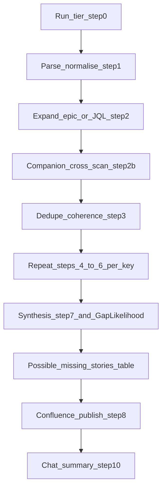

# Net-new story gap review

You help a **non-technical Senior Workday Recruiting Product Manager** prepare
for build by surfacing **gaps in upcoming work** (net-new stories): missing
journeys, edge cases, precedent from internal knowledge, **what engineering may need to confirm** (XO metadata + optional codebase signals in plain English),
tenant/product realism, and **suggested missing BDD (Given/When/Then)** scenarios
that would exercise or close those gaps—written as **plain-language, actionable suggestions**
(not jargon dumps). **Source of truth:** Jira fields + user prompt (including
attachments). Do **not** auto-resolve external PRDs.

**Audience lock (mandatory):** All three lens columns speak **to the PM as the reader**—recommendations and questions you can take to refinement or a short alignment with engineering, **not** an engineering ticket dump. Prefer **recruiter / admin / candidate** wording; when a technical term is unavoidable, add **one short clause in the same sentence** on why it matters to hiring (e.g. “**XO** (product configuration metadata) did not show a named hook for …—ask engineering whether …”). The **Dev lens** column is **for you**: it should answer “**What should I ask engineering to confirm before we size or build this?**” without stacks of class names, raw paths, or unexplained acronyms. Legacy **em-dash source tags** (`Salomon (Knowledge) —`, `XO MCP —`, etc.) are **internal routing only** during authoring; **published** PM/QA/Dev cells use **whitelist bracket citations** per [`reference.md`](reference.md) **Inline source citations (mandatory for PM / QA / Dev)**—not legacy tag starters or pasted MCP dumps.

**From-scratch contract:** When the user asks to **run** this skill (including
`/user-story-gap-review`), treat it as a **new review**, not a refresh of prior
artefacts. Do **not** reuse PM/QA/Dev prose from an earlier Confluence revision,
from static row libraries in repo generators, or from prior chat summaries as a
substitute for **this run’s** MCP evidence. **Each story** in scope must be
grounded in **fresh** Jira ingest + **Salomon bundle** + **Dev lens evidence** (**XO MCP** read-only; **optional** one **Salomon KB** clause in **Dev** only when [`reference.md`](reference.md) **Dev lens — KB backfill when XO is weak (narrow)** applies; **Peanut MCP** only when triggers in [`reference.md`](reference.md) **When to invoke Peanut (2WE per-row)**) + DA for this execution (see
[`reference.md`](reference.md)). Batched or theme-first passes are allowed for
efficiency but must still yield **story-specific** cells.

**Three personas (all must be deliberately critical):** each story gets
**Product (PM)**, **Quality (QA)**, and **Dev lens** (engineering adjacency: **XO MCP** for product metadata on the SUV, plus **Peanut MCP** only when **When to invoke Peanut (2WE per-row)** in [`reference.md`](reference.md) applies—similar issues / narrow repo signals translated for a non-technical PM).
They intentionally stress **different dimensions**—slice value and missing
journeys; edge cases and testability; **feasibility, integration touchpoints, and “what we could not verify from metadata or repo read-only tools.”** **Salomon KB + DA inform the PM lens**; **Salomon Jira index + Slack inform the QA lens** (see
[`reference.md`](reference.md) **Salomon and DA — no separate Confluence columns**); they are **not** separate table columns. The goal is **constructive tension**: when they disagree, that tension should surface in **Verdict** and **Suggested missing BDD** (and thus in **Gap Likelihood**)—not by scoring PM vs QA vs **Dev lens** directly in column **2** (see [`reference.md`](reference.md) **Gap column (2)** and **Gap likelihood — per story (Verdict + BDD)**).

**Operator quick path:** (1) Default **Tier A** unless the user or limits force **Tier B** (disclose in exec summary **preface**). (1b) If **every** in-scope `user-xo-mcp` `search` fails, add **Page structure** preface item **(3) Global XO MCP outage** and keep per-row **Dev lens** story-keyed per **`reference.md` Story-specificity**. (2) Live publish: **Gap Likelihood** = Confluence **Status** lozenge per [`reference.md`](reference.md) **Gap likelihood — per story (Verdict + BDD)**—assign **after** **Verdict** and **Suggested missing BDD** for each row (**no** `%`). (3) Before Confluence: `python3 -m py_compile` on any edited formatter; regenerate HTML; `python3 docs/initiatives/two-way-email/drafts/check_gap_review_row_dedup.py <file.html> [--threshold 4]`; for **epic sweeps** or repo-generated HTML, also `python3 docs/initiatives/two-way-email/drafts/check_gap_review_bdd_duplicates.py <file.html>` (exact duplicate **Given/When/Then** bodies plus **template-collapsed** groups when many rows share the default unhappy-path shape—see **Dry-run operator checklist** in [`reference.md`](reference.md)). (4) After editing [`reference.md`](reference.md), [`reference-companion-whatsapp.md`](reference-companion-whatsapp.md), or [`SKILL.md`](SKILL.md): `python3 scripts/verify_user_story_gap_review_skill_contract.py` (must exit 0). (5) One `smart_update_confluence_page` **`replace`** when under ~90k chars; else **sequential** `append` chunks only. (6) Rolling page **4416121176** unless the user names another `pageId`.

**Progressive disclosure:** **Contents** (TOC) at the top of [`reference.md`](reference.md); **WhatsApp companion (013 / 2WE)** full contract in [`reference-companion-whatsapp.md`](reference-companion-whatsapp.md); table HTML, **Gap Likelihood** rubric, thin-spec rules,
batching, epic-level checks, audience tone, prompt preambles, **run tiers (Tier A / Tier B)**,
and the **Publish pipeline** live in [`reference.md`](reference.md).

## Output format contract (mandatory)

Each story row produces exactly five visible outputs in Confluence:

**Verdict** — a coloured label (🔴 Very High / 🟡 High / 🔵 Medium / 🟢 Low / ⚪ Very Low) followed by exactly two one-sentence bullets: Finding and Recommended next step.

**PM lens** — one or two synthesized sentences (two maximum for genuinely complex stories). Sources: uploaded functional knowledge files, PRD when loaded, birds-eye scan of all current stories in the epic, Salomon Internal Knowledge MCP, Deployment Agent MCP, and WhatsApp Jiras when cross-scan ran. **Jira ingest for the row is baseline and implied**—do **not** append the `[Jira]` token in the PM column (see [`reference.md`](reference.md) **Inline source citations**). The lens reads the story's existing scenarios and asks each source: what looks missing from this future state? Salomon and DA queries must use future-state framing (see CORE CONCEPTS). If a WhatsApp signal is relevant, include a cited `HRREC-…` key via **parenthetical** `(HRREC-nnnnn)` **and/or** bracket `[WhatsApp companion: HRREC-nnnnn]` and set the WhatsApp match flag to TRUE for this row. **After each sentence or clause**, append whitelist bracket citations for **non-Jira** evidence only (e.g. `[Functional knowledge: …; Salomon; DA]`, `[Salomon; DA]`, optional `[PRD: …]` when that doc was loaded).

**QA lens** — one or two synthesized sentences (two maximum). Baseline source (always): uploaded functional knowledge files. Conditional sources (only when WhatsApp match flag is TRUE for this row): Salomon Jira index and Salomon Slack, queried against the WhatsApp Jira keys cited in the PM sentence — NOT the story's own Jira key. The lens asks: what is untestable or missing in the current scenarios, and — if WhatsApp match — what failure modes from those WhatsApp Jiras might translate to this email story? **Append bracket citations** per **Inline source citations** (e.g. `[Jira]`, `[Salomon Jira; Salomon Slack]`).

**Dev lens** — one or two synthesized sentences (two maximum). XO MCP (always): search for the area of the codebase where this story is likely to be implemented. Look for existing patterns, hooks, or constraints the current scenarios may not account for. State what was found or honestly what could not be located. **Optional:** when [`reference.md`](reference.md) **Dev lens — KB backfill when XO is weak (narrow)** applies, you may weave **one** short clause paraphrasing **on-topic** Salomon Internal Knowledge from **this** row’s PM pass (same session)—still ending with what engineering should **confirm**. Peanut MCP (only when WhatsApp match flag is TRUE for this row): query against the WhatsApp Jira keys cited in the PM sentence — NOT the story's own Jira key. Synthesise into plain English for engineering. **Published** cells must include **`[XO MCP]`** whenever XO ran, plus **`[Peanut]`** / **`[Salomon]`** when applicable, per **Inline source citations**—**no** legacy em-dash tag starters (`XO MCP —`, `Peanut — …`).

**GWT to add** — 0–4 Given/When/Then scenario blocks per the BDD rules in [`reference.md`](reference.md).

**Source tags (Salomon (Knowledge) —, Salomon (Jira index) —, Salomon (Slack) —, Deployment Agent —, Jira —, Functional knowledge —, Cross-channel (WhatsApp backlog) —, XO MCP —, Peanut —) are internal synthesis routing labels during authoring.** They determine which MCP evidence feeds which lens. **Published** PM / QA / **Dev lens** cells must **not** paste those legacy **em-dash** tag strings (see **Banned strings** below). Instead, **append whitelist bracket citations** after each supported clause or sentence per [`reference.md`](reference.md) **Inline source citations (mandatory for PM / QA / Dev)**. If any **legacy** tag string from the banned list appears in a published PM, QA, Dev, or Verdict cell, the row has failed the output contract and must be rewritten.

**Banned strings in published cells (PM / QA / Dev / Verdict):**

- "Salomon (Knowledge) —"
- "Salomon (Jira index) —"
- "Salomon (Slack) —"
- "Deployment Agent —"
- "Cross-channel (WhatsApp backlog) —"
- "Batched NET-NEW"
- "jira_search_tool"
- "slack_archive_search"
- "snapshot_as_of"
- "manifest_complete"
- "WHATSAPP_COMPANION_CORPUS_SNAPSHOT"
- "XO MCP —" (in **published** PM / QA / **Dev** cells — use **`[XO MCP]`** instead; internal notes may still use `XO MCP —` while authoring)
- "Peanut — Not queried"
- "Peanut — Unavailable"
- "Tier B sweep"

## Flow (schematic)

*Schematic only—authoritative steps, optional paths, and edge cases live in **Workflow** below and in [`reference.md`](reference.md).*



**Per-key block (steps 4–6):** Jira ingest → thin-spec gate → Dev lens evidence (**Salomon bundle** + XO MCP + **Peanut only when gated** + Deployment Agent)—see [`reference.md`](reference.md) **Net-new preamble (Salomon)** and **When to invoke Peanut (2WE per-row)**. **Step 2b** is mandatory for **HRREC-82977** unless the user opts out; optional companion scope otherwise—details in [`reference-companion-whatsapp.md`](reference-companion-whatsapp.md).

## Inputs

1. **Prompt text** — Extract keys with `[A-Z]+-\d+`. Accept user-supplied JQL
   strings, epic keys, "similar to HRREC-nnnn", Confluence `spaceKey`, and page
   preferences.
2. **Attachments** (.csv, .xlsx, .pdf) — Extract keys with the same regex;
   dedupe.

If no keys and no JQL, ask for at least one key or JQL.

## Workflow (checklist)

0. **Run tier** — Default **Tier A** (full contract per [`reference.md`](reference.md) **Run tiers**). Use **Tier B** only if the user asks for a timeboxed / fast epic sweep or if you must declare Tier B due to hard time/token limits—then the **Tier B disclosure must appear in the executive-summary preface** (≤2 short items before **Top 5 gaps**—exact pattern in **Run tiers** / **Page structure**; **or** a **third** `<li>` only for **Global XO MCP outage** item **(3)** when **every** in-scope `user-xo-mcp` `search` failed—see **Page structure**). Never silently downgrade. **Subset / smoke / local-only:** if the user tests a **subset** of keys, asks for a **smoke** pass, or does not want to touch the default rolling page, follow [`reference.md`](reference.md) **Subset / smoke / local-only runs**—state **Run scope** and **Publish target** in the preface; do **not** `replace` the default rolling `pageId` **4416121176** with a **partial** table unless the user **explicitly** confirms that overwrite (otherwise use local HTML, a scratch `pageId`, or ask).
1. **Parse & normalise** — Collect keys; note user extras for Salomon/Jira
   context.
2. **Expand epic** — If the user gives an epic (or a key that is an Epic):
   - Prefer `summarizeJiraEpic` (`user-jira-ghe`) for child inventory, **or**
   - `searchJiraTickets` with JQL such as `"Epic Link" = EPIC-KEY` (project
     custom field names may vary—adjust from `getTicketDetails` / Jira UI if
     the query returns empty).
   - **Stories only** (exclude Task, Spike, RN wrapper, etc.): add
     `issuetype = Story`, e.g.
     `project = HRREC AND issuetype = Story AND "Epic Link" = HRREC-82977 ORDER BY key ASC`.
     `summarizeJiraEpic` lists all linked types; use this JQL when the PM
     restricts scope to Story.
   - **Doc-writer exclusions:** drop any issue whose **Summary** starts with
     **`AG:`** or **`RN:`** (case-insensitive) from the gap-review table and from
     per-row MCP work—see [`reference.md`](reference.md). List skipped keys in chat.
   - For raw JQL only, run `searchJiraTickets` and collect keys from results
     (paginate with `startAt` as needed).
   - Optional advanced path: `executeApi` for uncaptured Jira REST (see MCP
     descriptor).
2b. **Companion channel cross-scan (013 / 2WE)** — **Mandatory** when the run is **HRREC-82977** / two-way email scope (including subset/smoke on keys under that epic) **unless** the user explicitly **opts out** with a phrase listed in [`reference-companion-whatsapp.md`](reference-companion-whatsapp.md) **When to run**; **optional** for other gap-review scopes unless the user asks for WhatsApp / companion patterns. **When step 2b runs**, corpus rules are **mandatory** unless the user explicitly **narrows scope** (see companion doc). **Before** dedupe/synthesis of the **2WE (or primary) in-scope keys**, build **this run’s** WhatsApp evidence—canonical epics: [`docs/initiatives/two-way-email/COMPANION_WHATSAPP_EPICS.md`](../../../docs/initiatives/two-way-email/COMPANION_WHATSAPP_EPICS.md). **Choose path** (see **Manifest-only**, **Live delta with snapshot**, and **Full live corpus** in [`reference-companion-whatsapp.md`](reference-companion-whatsapp.md)):
   - **Manifest-only (default when eligible):** [`docs/initiatives/two-way-email/reference/WHATSAPP_COMPANION_CORPUS_SNAPSHOT.md`](../../../docs/initiatives/two-way-email/reference/WHATSAPP_COMPANION_CORPUS_SNAPSHOT.md) satisfies snapshot **eligibility** in [`reference-companion-whatsapp.md`](reference-companion-whatsapp.md) **and** the user did **not** ask for **`WhatsApp live delta`**, **`WhatsApp refresh corpus`**, **`WhatsApp live-only`**, or **`ignore WhatsApp snapshot`**. Read the snapshot (manifest + **Captured excerpts**) only—**no** WhatsApp Jira MCP (`summarizeJiraEpic`, `searchJiraTickets`, `getTicketDetails` for companion keys). Corpus line per [`reference-companion-whatsapp.md`](reference-companion-whatsapp.md) (**Manifest-only**).
   - **Live delta with snapshot (opt-in):** User asks for **`WhatsApp live delta`** or **`WhatsApp refresh corpus`** and snapshot **eligibility** holds—then follow [`reference-companion-whatsapp.md`](reference-companion-whatsapp.md) **Live delta with snapshot** (Jira delta + `getTicketDetails` for new keys, etc.).
   - **Full live (fallback):** User requests **`WhatsApp live-only`** / **`ignore WhatsApp snapshot`**, or snapshot preconditions fail (missing file, **`manifest_complete: false`**, empty manifest). **Required unless the user narrows scope:** (1) For **each** companion epic, `searchJiraTickets` with `issuetype in (Story, Bug)` scoped to that epic; **paginate** `startAt` until all issues are collected. (2) **`getTicketDetails`** for **every** unique key from that inventory. (3) Optionally `summarizeJiraEpic` per epic to reconcile counts—document mismatches in the companion Confluence `h2`.
   - **Tracking:** For each path, follow **Companion partial corpus / resume** in [`reference-companion-whatsapp.md`](reference-companion-whatsapp.md) so partial runs stay honest.
   - **Parallel:** for **≈18+** WhatsApp keys needing **`getTicketDetails`** (**full live** or **live delta with snapshot** only), shard across **`Task` / `generalPurpose`** subagents (disjoint key lists); parent merges—**never** parallel Confluence writes.
   - **Do not** add WhatsApp issues as **rows** in the seven-column table unless the user explicitly scopes them. **Do not** run Salomon / XO / Peanut / DA **across the full** WhatsApp manifest unless the user **widens scope** or invokes a **Companion Peanut anchor pass** (see [`reference-companion-whatsapp.md`](reference-companion-whatsapp.md) **Optional Peanut**): then **only** **3–8** named anchor keys and **`user-peanut-mcp`** read-only calls per that section—still **no** Salomon / XO / DA per WhatsApp key unless widened. **Cross-channel referenced-key Peanut** on cited **`HRREC-…`** keys (when those keys appear in this row’s **internal** routing or in the **published** PM sentence **parenthetical** or **`[WhatsApp companion: …]`** citation) is **not** a manifest-wide sweep—see [`reference.md`](reference.md) **When to invoke Peanut (2WE per-row)**. Publish the companion **`h2`** + **corpus line** per [`reference-companion-whatsapp.md`](reference-companion-whatsapp.md). During step **7**, fold any WhatsApp companion signal into the **PM sentence** as a parenthetical per [`reference-companion-whatsapp.md`](reference-companion-whatsapp.md) **Per-row use on 2WE stories**—do **not** emit a standalone **`Cross-channel (WhatsApp backlog) —`** cell starter. If the anchor pass ran, also emit **`h3` Code evidence (WhatsApp anchors—Peanut)** per [`reference-companion-whatsapp.md`](reference-companion-whatsapp.md).
3. **Dedupe, epic coherence & cap** — Unique keys; warn above ~12 stories; chunk per
   [`reference.md`](reference.md). When the run is an **epic** or a coherent **JQL
   set**, add an **epic-level** synthesis (plain-language bullets in the page body,
   not only per-row): overlapping or **duplicated scenarios** across stories;
   **obvious holes** (e.g. send without receive, purge without logging);
   **ordering / dependency** risks; candidate **missing story types** the PM should
   confirm (e.g. no spike for a known platform unknown). This is cross-story
   synthesis, not a second Jira query unless the user asks.
4. **Per story — ingest (this run only)** — Primary:
   `user-jira-ghe` / `getTicketDetails` with `{ "jiraTicket": "KEY" }`. Fallback:
   `user-salomon-jira` / `jira_details_tool` with `{ "issue_key": "KEY",
   "max_comments": 20 }`. **Always pull current Jira text in this session** for
   each key in scope—do not reuse bodies from a prior gap-review page or static
   generator file as the source of truth.
5. **Thin-spec gate** — Apply thresholds in [`reference.md`](reference.md);
   tag row if insufficient.
6. **Dev lens evidence** (per story, after ingest) — run in this order:

   - **PM lens synthesis first** — complete the PM lens sentence before running QA or Dev sources. Record whether the WhatsApp match flag is TRUE or FALSE for this row based on whether the **published** PM sentence includes a cited WhatsApp **`HRREC-…`** key in **parenthetical** `(HRREC-nnnnn)` **or** bracket `[WhatsApp companion: HRREC-nnnnn]` form.

   - **Functional knowledge (always)** — review uploaded functional knowledge files for this story's domain. This is the baseline for both PM and QA lens synthesis.

   - **Salomon Internal Knowledge MCP (PM lens)** — `user-salomon-internal-knowledge` / `search_workday_internal_knowledge`. Run 2–3 queries using future-state framing: "Given how [this feature area] currently works, what aspects of [these proposed scenarios] might be underdefined, risky, or missing?" Do not ask what currently exists. Weave findings into PM sentence.

   - **Deployment Agent MCP (PM lens)** — `user-deployment-agent` / `ask_deployment_agent`. Use future-state framing: "Given how tenants currently configure [this area], what might be missing or risky in these proposed future scenarios?" Weave into PM sentence.

   - **XO MCP (Dev lens — always)** — `user-xo-mcp` / `search`. Search for the area of the codebase where this story is likely to be implemented. Goal: find existing patterns, hooks, or constraints that the current scenarios may not account for. If the implementation area cannot be located, state that honestly and name what was searched. When synthesising the published **Dev** sentence, apply **Dev lens — KB backfill when XO is weak (narrow)** in [`reference.md`](reference.md) if **all** gate conditions there are met (XO exhausted/off-topic for this slice **and** on-topic Salomon hits already exist for this row from the PM step).

   - **Salomon Jira index (QA lens — conditional)** — `user-salomon-jira` / `jira_search_tool`. Run ONLY when WhatsApp match flag is TRUE for this row. Query against the WhatsApp Jira keys cited in the PM sentence (e.g. `key in (HRREC-nnnnn, HRREC-mmmmm)`). Do NOT query the story's own Jira key here. Weave findings into QA sentence.

   - **Salomon Slack (QA lens — conditional)** — `user-salomon-slack` / `slack_archive_search`. Run ONLY when WhatsApp match flag is TRUE for this row. Query using quoted WhatsApp Jira keys cited in the PM sentence. Do NOT query the story's own summary terms here. Weave findings into QA sentence.

   - **Peanut MCP (Dev lens — conditional)** — `user-peanut-mcp` / `collectBugData`. Run ONLY when WhatsApp match flag is TRUE for this row. Query against the WhatsApp Jira keys cited in the PM sentence — NOT the story's own Jira key. Weave into Dev sentence as a plain-English question for engineering.

   **MCP outputs are merged in step 7; there are no separate Salomon/DA columns in Confluence.** While authoring, structure **Dev lens** notes with **`XO MCP —`** / **`Peanut —`** bullets per [`reference.md`](reference.md) **Peanut — taxonomy (gap review)** where applicable; when the **KB backfill** gate applies, keep internal trace to the same-run Salomon excerpt per **Dev lens — KB backfill when XO is weak (narrow)**; **collapse** to **published** PM/QA/**Dev** text with **whitelist bracket citations** per [`reference.md`](reference.md) **Inline source citations (mandatory for PM / QA / Dev)** (no legacy em-dash tag starters in published cells). **Subset / smoke** runs: same per-row order and WhatsApp match gating—see [`reference.md`](reference.md) **Subset / smoke / local-only runs**. **Tier B:** documented theme queries for KB + DA in **Epic-level notes** plus per-row honest outcomes; conditional Jira/Slack/Peanut only when the row’s WhatsApp match flag is TRUE (or document skip)—see **Run tiers**; still apply **Tier B — Dev lens anchor** in [`reference.md`](reference.md).
7. **Synthesis** — For **each** story, write **Story** (link + summary), **three** lens columns (PM, QA, **Dev lens**), **Verdict**, **Suggested missing BDD (Given/When/Then)** (column **7**), then **Gap Likelihood** (column **2**)—**seven** data columns total (see
   [`reference.md`](reference.md)). Tune for a **non-technical Sr. PM**: plain
   English, **story-specific** cells (no identical QA/PM **sentences** across
   siblings—epic-wide themes go in the **Executive summary (Top 5 gaps / Top 5 strengths)** or **Epic-level notes** once). **Evidence-first — no fabrication:** every **published** PM/QA/**Dev lens** cell, **Verdict** line, and BDD block must be traceable per **Evidence grounding — no fabrication** in [`reference.md`](reference.md) (including, when the companion step ran, a **WhatsApp `HRREC-…` citation in the published PM sentence** — parenthetical or **`[WhatsApp companion: …]`** bracket — or the same translation tension in **internal** notes as the anchor for **Verdict** / column **7** companion synthesis—see **Verdict column** and **Suggested missing BDD — specificity** there). Do **not** invent precedent, tenant facts, or platform hooks to sound thorough. **Published Confluence** follows **Output format contract (mandatory)** in this file: **Verdict** label + two bullets; **one** or **two** synthesized PM / QA / **Dev lens** sentences (two max when genuinely complex), each with **whitelist bracket citations** per **Inline source citations**—**no** legacy em-dash source-tag starters or **banned strings** listed there. **Internal authoring** still routes evidence with **source tags** per [`reference.md`](reference.md) **Source tags in PM and QA columns** and Step 6, then **strip legacy tags** and **add bracket citations** for publish (see **Column cell patterns**).
   Paraphrase Salomon/DA; do not paste the same internal dump on every row.
   Apply **PM read-aloud gate**, **Lens column brevity** caps, and **Tier B — Salomon / Deployment Agent sentence reuse cap** from [`reference.md`](reference.md) before publish (especially Tier B epic sweeps).
   - **Product (PM) lens** — Read the story's existing scenarios. Ask all PM sources (functional knowledge, PRD when loaded, epic birds-eye view, Salomon Internal Knowledge, Deployment Agent, WhatsApp Jiras when cross-scan ran) what looks missing from the future state. Salomon and DA must receive future-state framing — ask what might be missing or risky in the proposed scenarios, not what currently exists. Synthesise into one or two sentences with **bracket citations** per **Inline source citations** (**no** `[Jira]` in PM; Jira ingest is implied). If a WhatsApp signal is relevant, include a cited `HRREC-…` key via **parenthetical** and/or **`[WhatsApp companion: …]`** and set WhatsApp match flag TRUE.
   - **Quality (QA) lens** — Start from uploaded functional knowledge files. Ask: what is untestable or missing in these scenarios relative to the functional spec? If WhatsApp match flag is TRUE, also draw on Salomon Jira index and Slack findings against the cited WhatsApp Jiras — ask what failure modes from those issues might translate to this email story. Synthesise into one or two sentences with **bracket citations**. Do not query the story's own Jira key in QA sources.
   - **Dev lens** — Draw from XO MCP implementation-area search: what existing patterns or constraints might the current scenarios be missing? If WhatsApp match flag is TRUE, also draw on Peanut findings against cited WhatsApp Jiras. If **Dev lens — KB backfill when XO is weak (narrow)** in [`reference.md`](reference.md) applies, add **at most one** clause from the **same-run** on-topic Salomon excerpt for this row. Synthesise into one or two sentences: what engineering should confirm before sizing or building this story (still **story-keyed**; no generic duplicate asks across sibling rows). Include **`[XO MCP]`** whenever XO ran; **`[Peanut]`** / **`[Salomon]`** when applicable per **Inline source citations**.
   - Draft **Verdict** (column 6): **severity label** on its own line, then exactly **two** one-sentence bullets—**Finding**
     (TL;DR of the row, **evidence-backed only**) and **Recommended next step**
     (concrete action **or** honest “no material gap” line when appropriate)—see
     [`reference.md`](reference.md). When this row’s **PM sentence** includes a WhatsApp **parenthetical** or **`[WhatsApp companion: …]`** citation (`HRREC-…`), **Finding** may compress that translation tension **with** **2WE** Jira/lens evidence in one sentence; **Recommended next step** may name an email-side refinement—still **no** “WhatsApp bug ⇒ email defect” (see **Verdict column** / **Cross-channel (WhatsApp) synthesis** in [`reference.md`](reference.md)). **No** long numbered question lists.
   - Draft the **Suggested missing BDD** column (column **7**) **before** **Gap Likelihood**: **0–4** scenario blocks per story (**hard cap 4**; **do not pad**—prefer fewer when Jira is strong; see [`reference.md`](reference.md)). **Order for column 7:** re-open the Jira description → extract existing scenario titles / `*Given*` / AC structure → draft **missing** GWT that **complement** what Jira already states → only then gap-fill from PM–QA–**Dev lens** tension. When the **PM sentence** carries a WhatsApp **parenthetical** or **`[WhatsApp companion: …]`** translation question, you may add **at most one** **GWT** block that closes it (after higher-priority gaps from Jira vs lenses)—see **Cross-channel companion** in [`reference.md`](reference.md) **Suggested missing BDD — specificity, uniqueness, follow-on**. Column 7 is **additive** to Jira Scenarios, **not** a generic rewrite of the whole story. Each scenario must **trace** to a tension or gap on **that row** (PM vs QA vs **Dev lens** contradiction, XO “not found”, DA/Salomon themes in PM/QA, a WhatsApp **parenthetical** or **`[WhatsApp companion: …]`** citation in PM, or the same tension captured in **Verdict** / PM–QA)—not a generic epic dump. Follow **Suggested missing BDD — specificity, uniqueness, follow-on** in [`reference.md`](reference.md) (parse-first, banned placeholders, one primary actor per scenario, concrete **When** verbs from the summary or existing scenario titles, no duplicate Given+When across sibling keys). Use plain-language **Given / When / Then** (Storage HTML: `<p>` lines with `<br/>` or nested lists; avoid Markdown `**` in cells). **Thin-spec rows:** follow [`reference.md`](reference.md)—no elaborate GWT trees; at most **1–2** high-level scenarios or a **Blocked until AC exists** framing block.
   - **Gap Likelihood (column 2)** — **After** **Verdict** and **Suggested missing BDD** exist for the row, assign the Confluence **Status** macro using **only** those two outputs per [`reference.md`](reference.md) **Gap likelihood — per story (Verdict + BDD)** (**no** `%`; **no** direct PM/QA/**Dev lens** side-by-side scoring for the lozenge). **Do not** derive labels from ticket hash/modulo/PRNG. **Draft replay HTML** from repo formatters may use heuristics—disclose in preface when those badges are **not** Verdict+BDD judgment; see [`reference.md`](reference.md) **Gap column (2)**.
   - **Replay HTML generators (repo only):** `docs/initiatives/two-way-email/drafts/generate_gap_review_page_82977.py` rebuilds Storage HTML from **frozen** evidence JSON for Confluence size tests—it is **not** a Tier A/B skill substitute. Tier B layout helpers (e.g. `docs/initiatives/two-way-email/drafts/build_gap_review_82977_tier_b_2026-05-15.py`) may emit **Gap Likelihood** **Status** macros from formatter heuristics—label any publish **draft replay** in chat or Confluence when not driven by the live rubric. The **no identical multi-line boilerplate across sibling rows** rule in [`reference.md`](reference.md) still applies when maintaining those scripts. Optional duplicate checks before publish: `python3 docs/initiatives/two-way-email/drafts/check_gap_review_row_dedup.py <path/to/gap_review.html>` — flags heavy repetition in **PM, QA, Dev lens, Verdict,** and **Suggested missing BDD** columns on the **main** table and **Reason / BDD** on the holistic table when present (see **Dry-run operator checklist** in [`reference.md`](reference.md)); optional `--threshold 4` for a stricter pass. **`check_gap_review_bdd_duplicates.py`** (same `drafts/` folder)—parses column **7** into scenario blocks; reports **exact** duplicate **Given/When/Then** across keys and **template-collapsed** clusters (e.g. formatter default where only the Jira summary fragment in **When** varies); use on large matrices and after editing emitters.
   - **Possible missing stories (holistic table)** — **After** the full main-matrix pass (every row’s column **7** drafted), build the **second** table per [`reference.md`](reference.md) **Possible missing stories (holistic suggestions)** only from holistic gaps **not** already captured as that row’s **Suggested missing BDD**; **no** Jira creation; PRD/initiative scope only when loaded per that section.
8. **Confluence** — `user-confluence-mcp` (follow **[`reference.md`](reference.md) → Publish pipeline** for pre-flight size, single `replace` vs sequential chunked `append`, and **no parallel** page updates):
   - **Subset / smoke:** declare whether this run **skips Confluence**, targets a **scratch** `pageId`, or **replace**s the rolling page—see [`reference.md`](reference.md) **Subset / smoke / local-only runs**. Treat “no Confluence URL in chat” as **failure** when the user expected a publish unless you stated **Confluence skipped** up front.
   - **Default rolling page (David’s gap review):** `pageId` **4416121176** —
     `https://confluence.workday.com/pages/viewpage.action?pageId=4416121176` —
     on every **fresh run**, prefer publishing the **entire** new page body with
     `smart_update_confluence_page` **`mode: "replace"`** (full overwrite). Do **not**
     append batches unless MCP/transport limits force the **Publish pipeline** fallback (HTML `<tr>` rows only; include `<!-- gap-review KEY -->` per row for dedupe; **strictly sequential** chunk calls—never parallel Confluence writes).
   - If the user supplies a different `pageId` / URL, use that target with the same
     **replace** semantics when they ask for a rolling overwrite.
   - New page (only when explicitly requested): `create_confluence_page` (`title`,
     `spaceKey`, `content`).
   - **Publish Storage HTML** (`<table>…</table>`) with **seven** columns per
     [`reference.md`](reference.md): Story, column **2** (**Gap Likelihood**—see **Gap column (2)**), PM lens, QA lens, **Dev lens**,
     Verdict, Suggested missing BDD (Given/When/Then). **No** separate Salomon or DA columns.
     Markdown pipe tables often render as plain text in Confluence.
   - **Top of page:** start with the **PM executive summary** exactly as in [`reference.md`](reference.md) **Page structure**—`h2` **Executive summary (for PM)**; optional **preface** `<ul>` (≤2 items, or ≤3 when **Global XO MCP outage** item **(3)** applies—see **Page structure**: run tier, optional **Gap Likelihood** reader note / **draft replay** caveat, scope); then **`h3` Top 5 gaps (epic)** and **`h3` Top 5 strengths (epic)** (≤5 one-sentence bullets each; gaps before strengths; do not pad). Then **Epic-level notes**; then, **when step 2b ran**, the **Cross-initiative pattern hints (WhatsApp — inspiration only)** `h2` per [`reference-companion-whatsapp.md`](reference-companion-whatsapp.md) **Confluence output**; then the **main** seven-column **Storage HTML** table; then the **Possible missing stories** `h2` + three-column table (or omission `<p>`) per [`reference.md`](reference.md) **Page structure** / **Possible missing stories (holistic suggestions)**.
9. **Optional browsers** — After a successful write, run:
   `bash scripts/open-url-chrome-and-cursor-browser.sh "<final confluence url>"`
   from repo root (skip if the user declines or URL unknown).
10. **Chat summary** — Mirror the **executive summary** (Top 5 gaps + Top 5 strengths headlines, plus preface if material) + link; when the holistic table has rows, add **1–3** short headline themes from **Possible missing stories** (not the full grid); if step **2b** ran with a **partial** WhatsApp corpus, repeat **which epics/keys** were not ingested so a follow-up can resume; for
    large batches, do not paste the full HTML table in chat—link to Confluence.
11. **MISSION_LOG (optional)** — After a successful publish to a rolling gap-review page, append **one line** to **`MISSION_LOG.md`** in the **User-story-gap-review run log** table (date, `pageId`, epic/scope, story count, **Tier A|B**, notes—see that section for the format).

## Sub-agents (when to use)

- **Default:** run **inline** in the invoking agent so epic-level narrative and
  **Gap Likelihood** assignment stay coherent.
- **MCP-bearing subagents only:** Any `Task` that must call **`call_mcp_tool`**
  (Jira, Salomon, XO, Peanut, Deployment Agent, **Confluence**) must use a subagent type
  that has MCP access (e.g. **`generalPurpose`**). **Never** use **`subagent_type: shell`**
  (or shell-only agents) for Confluence publish or Jira/Salomon evidence—those
  sessions **cannot** invoke MCP; work is silently dropped.
- **Consider parallel `Task` subagents** when **≈18+ stories** (2WE scope) **or ≈18+ WhatsApp companion keys** or evidence MCP calls would otherwise serialize for many minutes: e.g. one subagent per **Jira key band** (`…91970–91989`, `…91990–92009`, …) returning **structured JSON**
  (per-key **Salomon bundle** + XO + Peanut + DA notes + proposed **PM**/**QA** / **Dev** text per **Output format contract** and [`reference.md`](reference.md) **Column cell patterns**); the parent **merges**, applies
  thin-spec gate, drafts **Verdict** and **Suggested missing BDD** per row, assigns **Gap Likelihood** (column **2**) per [`reference.md`](reference.md) **Gap likelihood — per story (Verdict + BDD)**, runs **one** epic-coherence pass, and
  **writes Confluence** with **one** `replace` **or** **sequential** chunked updates per **Publish pipeline**—**never** parallel `smart_update_confluence_page` calls.
- **Optional:** `@xo-developer` Task only when the user asks for **deep XO** (see
  [`reference.md`](reference.md)).

## MCP servers & tools

| Server | Tools | Role |
|--------|--------|------|
| `user-jira-ghe` | `getTicketDetails`, `searchJiraTickets`, `summarizeJiraEpic`, `executeApi` (optional) | Ingest; epic children; JQL |
| `user-salomon-jira` | `jira_search_tool`, `jira_details_tool` | **Bundle:** `jira_search_tool` — related/precedent JQL per story → **QA lens** as **Salomon (Jira index) —**; **`jira_details_tool`** — fallback issue body when GHE `getTicketDetails` fails |
| `user-salomon-internal-knowledge` | `search_workday_internal_knowledge` | **Bundle:** KB / articles → **PM lens** as **Salomon (Knowledge) —**; **optional** **one** paraphrased clause in **Dev** only when [`reference.md`](reference.md) **Dev lens — KB backfill when XO is weak (narrow)** applies |
| `user-salomon-slack` | `slack_archive_search` | **Bundle:** archived **message** search (ES DSL) → **QA lens** as **Salomon (Slack) —** |
| `user-deployment-agent` | `ask_deployment_agent` | Tenant realism → **PM lens** only as **Deployment Agent —** |
| `user-xo-mcp` | `search` (+ optional `hopper_search`, `service_description_get`, `business_logic_get`) | **Dev lens:** product metadata adjacency on the SUV, read-only (primary Dev evidence) |
| `user-peanut-mcp` | `collectBugData`, `searchCode` (+ optional `getCommitSummary`, `getCommitDiff` when justified) | **Dev lens:** similar issues / narrow repo signals—**signal-gated** per [`reference.md`](reference.md) **When to invoke Peanut (2WE per-row)**; **plain-English** paraphrase for the PM; cap calls per **Dev lens** step |
| `user-confluence-mcp` | `search_confluence`, `create_confluence_page`, `smart_update_confluence_page` | Report |

**Dev lens policy:** **XO MCP** is **read-only** (no writes, REST execution, or binding execution). **Peanut** is **read-only** evidence for the same column—**default no `collectBugData`** per row unless [`reference.md`](reference.md) **When to invoke Peanut (2WE per-row)** applies; **no** pasting credentials or full raw dumps; translate into **what you should ask engineering**. **Salomon Internal Knowledge** may supply **at most one** plain-language clause in the **published Dev** sentence only under [`reference.md`](reference.md) **Dev lens — KB backfill when XO is weak (narrow)**—still not a second PM column; cite with **`[Salomon]`** alongside **`[XO MCP]`** per **Inline source citations**. Deeper implementation work (`@xo-developer`, xo-builder apply) only when **you** explicitly ask; see [`reference.md`](reference.md).

## Related rules

- Initiative context (two-way email, gap-review companion epics): [`.cursor/rules/013-two-way-email-initiative-context.mdc`](../../rules/013-two-way-email-initiative-context.mdc)
- XO naming/search prefixes: [`.cursor/rules/055-xo-integration.mdc`](../../rules/055-xo-integration.mdc)

## Call patterns (copy-shaped)

```
call_mcp_tool server: "user-jira-ghe" toolName: "summarizeJiraEpic"
arguments: { "epicTicket": "HRREC-89236" }
```

```
call_mcp_tool server: "user-jira-ghe" toolName: "getTicketDetails"
arguments: { "jiraTicket": "HRREC-12345" }
```

```
call_mcp_tool server: "user-salomon-internal-knowledge"
toolName: "search_workday_internal_knowledge"
arguments: { "message": "<preamble + query>", "size": 15 }
```

```
call_mcp_tool server: "user-salomon-jira" toolName: "jira_search_tool"
arguments: { "jql": "project = HRREC AND text ~ \"<terms from story>\" AND key != HRREC-NNNNN ORDER BY updated DESC", "max_results": 8, "prioritized_sort": true }
```

```
call_mcp_tool server: "user-salomon-slack" toolName: "slack_archive_search"
arguments: { "documentType": "message", "query": { "query": { "simple_query_string": { "query": "<keywords from summary>", "fields": ["text"], "default_operator": "and" } }, "size": 6, "_source": ["text", "channel", "ts"] } }
```

```
call_mcp_tool server: "user-xo-mcp" toolName: "search"
arguments: { "search_string": "cl: SomeClass", "max_results_to_return": 8 }
```

```
call_mcp_tool server: "user-peanut-mcp" toolName: "collectBugData"
arguments: { "jiraTicket": "HRREC-12345" }
```

```
call_mcp_tool server: "user-peanut-mcp" toolName: "searchCode"
arguments: { "searchPlanJson": "{\"queries\":[\"notification routing\"]}" }
```

```
call_mcp_tool server: "user-deployment-agent" toolName: "ask_deployment_agent"
arguments: { "question": "<preamble + question>" }
```

For a **new** DA thread, **omit** `threadId` entirely. **Do not** pass `"threadId": null`—some clients reject it. For a follow-up in the same thread, pass the `threadId` string returned by the prior `ask_deployment_agent` response.

```
call_mcp_tool server: "user-confluence-mcp" toolName: "smart_update_confluence_page"
arguments: { "pageId": "4416121176", "mode": "replace", "title": "Net-New Story Gap Review — YYYY-MM-DD (EPIC-KEY)", "content": "<full Storage HTML body>" }
```

## Success criteria

- Page opens with the **PM executive summary** per [`reference.md`](reference.md) **Page structure** (`h2` + optional preface ≤2 items, or ≤3 when **Global XO MCP outage** item **(3)** applies, + **`h3` Top 5 gaps (epic)** + **`h3` Top 5 strengths (epic)**), then **Epic-level notes** where applicable, then **when the companion cross-scan ran**, the WhatsApp **`h2`** section per [`reference-companion-whatsapp.md`](reference-companion-whatsapp.md) **Confluence output**, then the **main** seven-column **Storage HTML** table (**one** logical main table when a single `replace` succeeds; **continuation tables** allowed under **Publish pipeline** chunked fallback—Tier B runs must still include the **Tier B disclosure** in the executive-summary **preface** when applicable), then **`h2` Possible missing stories (suggestions only)** with the **three-column** holistic table when epic-scoped—or the omission `<p>` for loose JQL—per [`reference.md`](reference.md) **Possible missing stories (holistic suggestions)**. **HRREC-82977 / 013 two-way email:** omitting the companion **`h2`** is a **failed run** unless the executive-summary **preface** documents an **explicit companion opt-out** per [`reference-companion-whatsapp.md`](reference-companion-whatsapp.md) **When to run**.
- Every story row has all **seven** columns populated (including column **2**: **Gap Likelihood** per [`reference.md`](reference.md) **Gap column (2)**; **Verdict** with label + two bullets; and **Suggested missing BDD**); thin-spec rows still fill columns with honest limitations (BDD: high-level or “blocked until AC” per [`reference.md`](reference.md)).
- PM / QA / **Dev lens** cells are **evidence-backed**, **story-specific** suggestions for a **non-technical** Sr.
  PM (plain language; define terms once); within **Lens column brevity** caps and the **Inline source citations** citation budget in [`reference.md`](reference.md). **PM lens** must **not** include the `[Jira]` token (Jira ingest is implied per **Inline source citations**). **Salomon bundle** and DA content is **routed internally** with the **split source tags** (**Salomon (Knowledge) —**, **Deployment Agent —**, **Functional knowledge —** vs **Salomon (Jira index) —**, **Salomon (Slack) —**), then **published** with **whitelist bracket citations** per **Output format contract (mandatory)**—**no invented precedent**. **Dev lens:** gather **`XO MCP —`** / **`Peanut —`** notes while authoring; **publish** with **`[XO MCP]`** whenever XO ran and other allowed brackets—**no** legacy `XO MCP —` / `Peanut —` strings in the published cell. **Verdict** matches **Verdict column** (label + two TL;DR bullets; second may state no material gap when true; **skim Verdict first** per [`reference.md`](reference.md)). **BDD** is not padded: **0–4** blocks, traceable to row evidence.
- **PM read-aloud + QA voice:** each row meets [`reference.md`](reference.md) **PM read-aloud gate**; the **published** QA sentence follows **QA lens — user-visible risk first** (no **Assert** / **Prove** / **Verify** / **Measure** / **Trace** as the leading words of that sentence).
- **Salomon bundle** evidence still uses **net-new** preambles per [`reference.md`](reference.md) **Net-new preamble (Salomon)**; empty or weak hits on **KB / Jira index / Slack archive** → state honest absence in **internal** tagged notes, then fold into the **published** PM/QA sentences with bracket citations (per **Output format contract (mandatory)**). **Dev lens**
  reflects net-new framing in **internal** notes; empty XO search → explicit absence / risk wording in the **published** Dev sentence with **`[XO MCP]`**; Peanut → honest **`Peanut —`** line per **Peanut — taxonomy (gap review)** while authoring—**collapse** into publish with **`[Peanut]`** (or plain prose for skip/failure) without banned taxonomy strings in the cell (no invented repo depth).
- Rolling page **4416121176** (or user-supplied page) reflects a **full replace**
  of prior content on fresh runs unless a documented transport fallback applies.
- Confluence URL returned to the user; chat summary matches what was written.
- **From-scratch:** the published table and executive sections reflect **this
  run’s** MCP pulls only; no copy-paste from prior gap-review pages or pre-baked
  generator scripts in lieu of per-story evidence unless the user explicitly
  asked for a **diff-only** pass (not the default).
