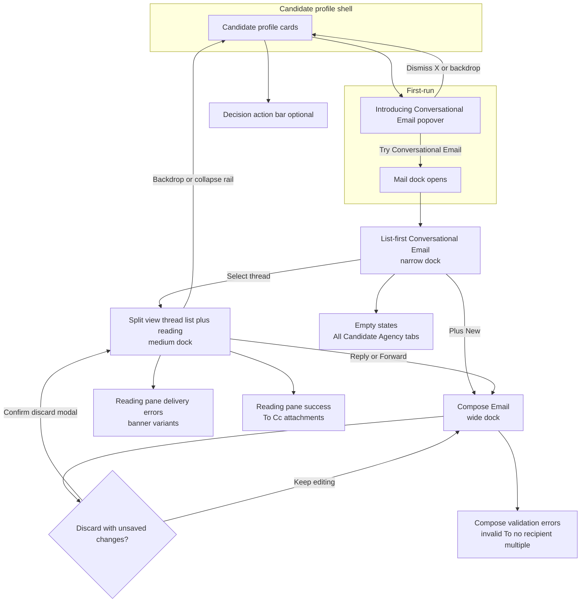

# 2-way email prototype — UX flow

Canonical route: `#2-way-email-prototype` (legacy `#india-candidate-profile-email-v92`).

Optional **hash query** for demos (parsed by the prototype): `#2-way-email-prototype?nav=overview&mail=compose` — see **Prototype Control** panel in dev builds.

Figma file: [2-Way Email Recruiting 12/2024](https://www.figma.com/design/HpAOHGAeXBORpHnyhsCMja/2-Way-Email_Recruiting_12_2024).

Committed export index: [`design/reference-screens/2way-email-figma-export-2026/README.md`](reference-screens/2way-email-figma-export-2026/README.md).

## Flow diagram

## Figma export filename → flow stage

Use this table when filing screenshots under [`design/reference-screens/2way-email-figma-export-2026/`](reference-screens/2way-email-figma-export-2026/).

| Export pattern | Flow stage |
|----------------|------------|
| `Overview-1-*`, popover / Introducing | **Onboarding** popover |
| `Overview-2*`, `Threads_-_Linear*`, list-heavy Overview | **List-first** mail dock |
| `Overview-3*` … `Overview-15*`, inbound expanded | **Split read** + variants |
| `Compose-*`, `Reply-*`, `Forward-*` | **Compose** / reply / forward |
| `Error_*` | **Compose** validation |
| `Discard-*` | **Discard** confirmation |
| `Empty_State_*` | **Empty** inbox states |
| `Action_Bar-*` | **Decision** action bar |

## Screen ↔ Figma nodes (legacy reference)

| Step | Node ID | Description |
|------|---------|-------------|
| Introducing CE popover | [6887:23176](https://www.figma.com/design/HpAOHGAeXBORpHnyhsCMja/2-Way-Email_Recruiting_12_2024?node-id=6887-23176) | Anchored popover (replaces old full-screen highlights) |
| Thread list | [6887:11657](https://www.figma.com/design/HpAOHGAeXBORpHnyhsCMja/2-Way-Email_Recruiting_12_2024?node-id=6887-11657) | List-first after opening Email |
| Reading pane | [6887:12795](https://www.figma.com/design/HpAOHGAeXBORpHnyhsCMja/2-Way-Email_Recruiting_12_2024?node-id=6887-12795) | Split view after selecting a thread |
| Compose | [6887:14115](https://www.figma.com/design/HpAOHGAeXBORpHnyhsCMja/2-Way-Email_Recruiting_12_2024?node-id=6887-14115) | Compose / reply / forward |
| Decision bar | [6887:21505](https://www.figma.com/design/HpAOHGAeXBORpHnyhsCMja/2-Way-Email_Recruiting_12_2024?node-id=6887-21505) | Bottom strip |

## Implementation notes

- Closing the collaboration sheet increments `threadsResetKey`, clearing the selected thread so the next open starts again at **list-first**.
- **Dock width** follows surface: narrow (list-only), medium (split), wide (compose) — see constants in [`2-way-email-prototype.tsx`](2-way-email-prototype.tsx).
- **Prototype Control** (bottom-left, dev / `?proto=1`): toggles audience, thread presets, delivery **error banner** copy, compose placeholder, and dock width override for parity demos.
- Validation-state demos on compose remain **dev-only** (`import.meta.env.DEV`) unless driven by Prototype Control.
