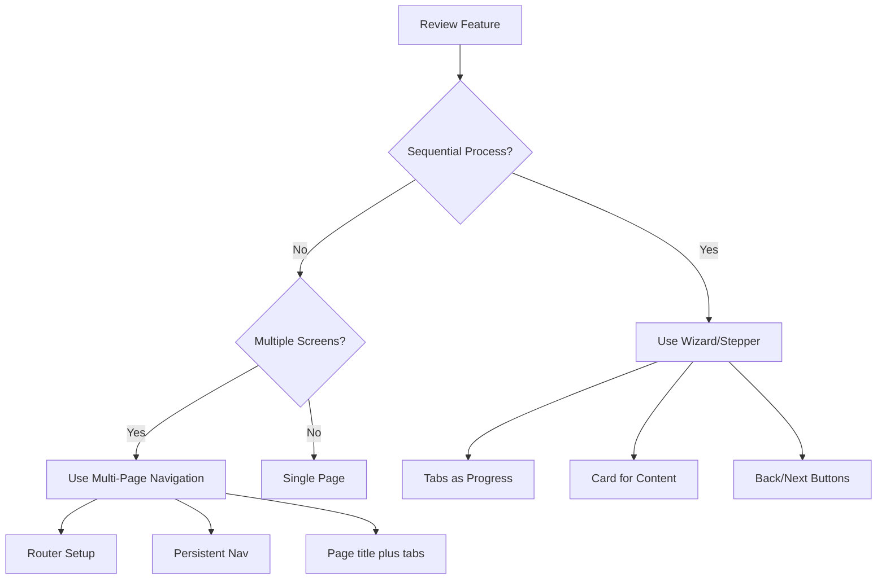

# Design Prototyping Workflow

This folder contains prototypes, design documentation, and reference materials for Workday Recruiting UI implementations.

## Local prototype entry URLs (dev server)

With **`npm run dev`** (port **5199**):

- **`http://localhost:5199/`** — default shell loads **Recruiter Homepage v85** (AI-native homepage).
- **`http://localhost:5199/#/recruiter-home-v85`** — **Recruiter Homepage v85** (AI Daily Briefing, smart candidate recommendations, pipeline health, personalized metrics).
- **`http://localhost:5199/#/candidate-grid-v84`** — **Candidate grid redesign v84** (enhanced tabs: Dashboard, Job Requisitions, Candidates, Reports with full functionality and HiredScore integration).
- **`http://localhost:5199/gcc-candidate-grid-redesign-v52`** — **Candidate grid redesign v52** (GCC-E2E-011; copy from **319**; unified modal, hub tabs).
- **`http://localhost:5199/gcc-candidate-grid-v46`** — **Candidate grid redesign v46** (unified modal, hub tabs Requisitions / Candidates / Offers / Analytics).
- **`http://localhost:5199/gcc-candidate-grid-v46?mode=anonymised`** — same prototype in **anonymised review** mode (Works Council–style masking).
- Optional query flags (v46): **`empty=1`** (empty grid copy), **`gridError=1`** (grid error banner), **`cvError=1`** (CV error banner in modal). Combine with `&` as needed.
- Hash fallback: **`http://localhost:5199/#/gcc-candidate-grid-v46`**.
- **`http://localhost:5199/bp-durations?view=detail&bp=offer`** — Sub-BP duration dashboard (segment filters: `tenant`, `region`, `industry` query params; Offer detail adds task-level charts from [`data-offer-steps.ts`](data-offer-steps.ts) plus [`data-bp-durations.ts`](data-bp-durations.ts)). The **Add documents** footer is shown only when [`data-add-documents.ts`](data-add-documents.ts) is populated from Pharos or an approved export (never placeholder numbers).
- **`http://localhost:5199/customer-scorecard`** — Customer scorecard: IUM time to hire / time to fill + PCA-based Talent Acquisition feature adoption from `dw.uxinsights_prod.customer360` joined to `dw.user_data.task_to_pca_mapping` (enabled = any mapped task usage > 0 in the selected period). Includes:
  - Landing view: **all** PCA features correlated with lower TTF/TTH (correlation only, non-causal) with **Industry** and **Region** segment filters for on-the-fly re-ranking, plus **Top 10 tenants** by adoption score with industry/region columns.
  - Tenant view: Data Scientist adoption score + segment-aware missing feature recommendations for lower TTF/TTH + peer benchmarking (top 3 segment peers by Jaccard similarity).
  - TTF metric uses >0 filter from IUM 2359 (null where no data reported). Industry/region enriched from `dw.user_test.interview_dashboard_tenant_filters`.
  - Lazy-loaded via `React.lazy()` + `Suspense` for performance (6.7MB data file loaded on demand).
  - Optional **`?tenant=`** deep link.

## Published previews (timestamped URLs)

CI can deploy each build to **GitHub / GHE Pages** under `preview/preview-<UTC>-<run_id>/`. Setup and URL rules: **[docs/gh-pages-preview.md](../docs/gh-pages-preview.md)**.

## Figma Design Reference

**Source**: [2-Way Email Recruiting](https://www.figma.com/design/HpAOHGAeXBORpHnyhsCMja/2-Way-Email_Recruiting_12_2024)

This Figma file contains the approved design system, UI patterns, and component styles for Workday Recruiting features.

### Capture this prototype to Figma (html-to-design MCP)

1. **Dev server** — from this folder run `npm run dev`. Vite is pinned to **`http://localhost:5199/`** (`strictPort: true` in `vite.config.ts`) so capture hash URLs always match the running app. On listen, the dev server **opens that URL in Google Chrome (new window) and Cursor’s Simple Browser** (see repo `scripts/open-url-chrome-and-cursor-browser.sh`). To skip: `VITE_NO_OPEN_BROWSERS=1 npm run dev`. If the server was **already running** when you opened the project (no fresh `listening` event), run **`npm run open:browsers`** from this folder to open both again.
2. **Figma `capture.js`** — On load, the script runs **`Kt()`**, which **reads `#figmacapture` from the URL** and starts its own automatic multi-capture flow. **`main.tsx` removes figma hash params synchronously** (before the script runs), then calls **`window.figma.captureForDesign({ captureId, endpoint, selector, delayMs })` exactly once** so only one submission runs per `captureId`. Non-figma hash keys (e.g. **`country=`**) are preserved. Default **`figmadelay` is 6000ms** when omitted. Default **`figmaselector`** is **`#figma-capture-root`**. After load, the address bar **no longer shows** `figmacapture` / `figmaendpoint` — that is expected. If the Figma file is **blank**, raise **`figmadelay`** (e.g. **`10000`**) and use a **new** `captureId` from MCP.
3. **Agent flow (Figma MCP only)** — Call **official Figma MCP** `generate_figma_design` (new file or existing file). Open the returned **`http://localhost:5199/#figmacapture=…&figmaendpoint=…`** URL **once** in a browser (e.g. macOS `open "http://localhost:5199/#figmacapture=…"`). Do not rely on any in-app paste UI — capture is driven entirely by **MCP + URL + `main.tsx`**. Poll MCP with the **`captureId`** until status is **`completed`**.
4. If port **5199** is already taken, stop the other process or temporarily change `vite.config.ts` and use the same port in the capture URL.

#### Fresh Figma file every run (no clipboard, no paste)

Html-to-design can **create a new Figma file automatically** on each capture. You only need to avoid reusing a spent `captureId`.

1. **MCP call** — In one shot, pass **`outputMode: "newFile"`**, a unique **`fileName`** (e.g. `GCC Nationalisation — 20 Mar 2026 — v2`), and your org **`planKey`**. Do **not** use **`clipboard`** unless you explicitly want “Copy instead” / paste-in-Figma.
2. **New id every time** — Before each capture, call **`generate_figma_design`** again. Each response includes a **new** `captureId` and hash URL. **Never** reuse yesterday’s link, refresh a tab that already submitted, or run `open` twice on the same hash.
3. **Open the new URL once** — Load the URL from **that** response only. `main.tsx` also listens for **`hashchange`**, so the agent can point the same tab at a **new** hash (new `captureId`) for a follow-up capture without a full reload.
4. **Poll** — Keep polling with the **`captureId`** from that same run until the MCP reports `completed`; the response should include the **new file** / claim URL.

You cannot get a new server-side file from an old `captureId`; “Capture already submitted” always means **request a new capture from MCP**, then use the **new** URL.

#### Troubleshooting: "Capture already submitted"

This message comes from **Figma’s html-to-design service**, not from a broken MCP install. Each **`captureId` is single-use**: the browser may only submit that id **once**. Typical causes:

- You **refreshed** the tab that had `#figmacapture=…` in the URL  
- You **opened the same hash URL twice**  
- An agent ran `open …#figmacapture=old-id` again after a successful submit  
- **Double submit**: Figma’s boot **`Kt()`** saw `#figmacapture` **and** the app also called **`captureForDesign`** (older builds). Current **`main.tsx`** strips figma params from the URL before **`capture.js`** executes so **`Kt()`** is a no-op; only **`captureForDesign`** runs.

**Fix:** In Cursor, ask the agent to call Figma MCP **`generate_figma_design`** again (same `outputMode` / file target) to get a **new** `captureId`, then open **`http://localhost:5199/#figmacapture=<new-id>&figmaendpoint=…`** **once**. Use MCP **polling** with the new id only — do not rely on reloading the browser to "retry".

## Reusable Component Library

### Shell Components
- **`WorkdayTopNav`** - Global navigation: grey bar, pill search, utilities, avatar, tenant heading
- **`WorkdayLeftTabBar`** - Primary icon rail + secondary vertical tabs (grey columns, pill active state)
- **`CommunicationDock`** - Sliding panel wrapper: rail buttons, animated panel, shadow depth
- **`ProfilePageLayout`** - Hub-style page layout: header card (avatar/title/actions) + tab navigation + optional communication dock (for candidate profiles, worker profiles, requisition details, hiring manager views)

### Communication Components
- **`SanaCommComposer`** - Simple pill textarea + circular send button (WhatsApp, SMS, Notes, LINE)
- **`SanaCommMessageBubble`** - Message threading bubbles (white bg, soap border, 12px radius)
- **`EmailPanel`** - Full email UI: thread sidebar (250px) + rich text composer + Gmail threading (950px total)
- **`EmailComposer`** - Email composition: From/To/Cc/Subject + rich text + branding + send (no thread sidebar)
- **`RichTextEditor`** - Standalone rich text input: contentEditable + formatting toolbar (Bold/Italic/Underline/Link/List) + email templates (6 recruiting templates with token replacement) + GenAI improvement (mocked with realistic transformations)
- **`ThreadExpansion`** - Gmail-style inline thread toggle: "Show N messages" / "Hide previous messages"

### Candidate Portal Components
- **`CandidateHomeLayout`** - Full-page candidate home: blue header, two-column layout (tasks + applications in main, sidebar widgets in sidebar)
- **`CandidateTaskModal`** - Generic modal overlay for candidate tasks (dark overlay + centered card with close handling)
- **`AdobeSignAadhaarFlow`** - 4-step Adobe Sign simulation with NSDL e-Gov Aadhaar authentication (NSDL consent → Aadhaar entry → OTP → Success)
- **`DocumentReviewTask`** - Offer document review with consent and Adobe Sign integration (pre-Adobe consent state, post-Adobe confirmation state)
- **`CareerSiteHero`** - Large search prompt area for external career sites (from `CandidateExperiencePatterns.tsx`)
- **`JobCard`** - Clean job listing card (from `CandidateExperiencePatterns.tsx`)
- **`JobDetailsStickyFooter`** - Bottom-docked "Apply with Assistant" CTA (from `CandidateExperiencePatterns.tsx`)

### Generative UI (GenUI) / A2UI Components
- **`A2UIRenderer`** - Rendering engine that maps JSON payloads to Canvas Kit components (`A2UIRenderer.tsx`)
- **`CandidateActionCard`** - Quick review card with name, metadata, Reject/Advance buttons (`GenUIPatterns.tsx`)
- **`DraftMessage`** - Agent-drafted communication card with recipient, body, Edit/Send buttons (`GenUIPatterns.tsx`)
- **`CandidateGrid`** / **`JobReqGrid`** - Tabular data displays using Canvas Kit `Table` (`GenUIPatterns.tsx`)
- **`CandidateCarousel`** - Side-by-side comparison of `StructuredResume` profiles (`GenUIPatterns.tsx`)
- **`ChartCard`** - Data visualization wrapper using `react-chartjs-2` and Canvas Kit `Card` (`GenUIPatterns.tsx`)

### Usage Patterns

**Simple messaging (WhatsApp, SMS):**
```tsx
<SanaCommComposer 
  value={msg} 
  onChange={setMsg} 
  placeholder="Type message..."
  onSend={send} 
/>
{messages.map(m => (
  <SanaCommMessageBubble align={m.align} timestamp={m.timestamp}>
    {m.text}
  </SanaCommMessageBubble>
))}
```

**Full-page agentic chat (scheduling, screening, Q&A, Recruiter Hub):**
Uses the same `SanaCommComposer` and `SanaCommMessageBubble` components as simple messaging, but laid out in a main column instead of a sliding dock. Pair assistant bubbles with Canvas Kit `Avatar`. For GenUI, pass `A2UINode` payloads into the `A2UIRenderer` inside the bubble. See `015-sana-style-ui.md` and `communication-patterns.md` for full requirements.

**Full email (with threading):**
```tsx
<CommunicationDock
  channels={[
    {
      id: 'email',
      icon: mailIcon,
      label: 'Email',
      expandedWidthPx: 950,
      panel: (
        <EmailPanel
          threads={emailThreads}
          activeThreadId={activeId}
          onThreadSelect={setActiveId}
          onNewEmail={resetFields}
          from={from} to={to} cc={cc} subject={subject} body={body}
          onFromChange={setFrom} onToChange={setTo}
          onCcChange={setCc} onSubjectChange={setSubject}
          onBodyChange={(html, text) => setBody(text)}
          onSend={sendEmail}
          onClosePanel={collapse}
          showBranding brandingChecked={branding}
          onBrandingChange={setBranding}
        />
      )
    }
  ]}
/>
```

**Simple email (compose only):**
```tsx
<EmailComposer
  from={from} to={to} subject={subject} body={body}
  onFromChange={setFrom} onToChange={setTo}
  onSubjectChange={setSubject}
  onBodyChange={(html, text) => setBody(text)}
  onSend={sendEmail}
/>
```

**Standalone rich text:**
```tsx
// Basic usage
<RichTextEditor
  value={content}
  onChange={(html, text) => setContent(text)}
  placeholder="Type here..."
  minHeight={200}
/>

// With templates and GenAI (recruiting email example)
<RichTextEditor
  value={emailBody}
  onChange={(html, text) => setEmailBody(text)}
  placeholder="Type your email..."
  showTemplates  // Shows 6 recruiting email templates dropdown
  showGenAI      // Shows sparkle icon for text improvement
  candidateData={{
    firstName: 'Sarah',
    jobTitle: 'Senior Product Manager',
    requisitionId: 'REQ-2024-1234',
    recruiterName: 'David Denham',
    companyName: 'Workday'
  }}
/>

// Available templates (auto-populated with token replacement):
// 1. Interview Availability Request
// 2. Interview Confirmation
// 3. Offer Renegotiation
// 4. Application Status Update
// 5. Additional Documents Request
// 6. Pre-Screen Questions Follow-Up
```

**Profile page layout:**
```tsx
import { ProfilePageLayout, type ProfileTab, cardStyle } from './components';

const TABS: ProfileTab[] = [
  { id: 'overview', label: 'Overview' },
  { id: 'applications', label: 'Job applications' },
  { id: 'screening', label: 'Screening' },
  // ... more tabs
];

<ProfilePageLayout
  // Header
  avatar={<Avatar size={64} altText={candidate.name} as="div" />}
  name={candidate.name}
  subtitle={`${candidate.title} · ${candidate.jobReq} · ${candidate.location}`}
  headerActions={[
    <SecondaryButton size="small">Move forward</SecondaryButton>,
    <SecondaryButton size="small">Reject</SecondaryButton>
  ]}
  
  // Tabs
  tabs={TABS}
  activeTabId={activeTab}
  onTabChange={setActiveTab}
  secondaryTitle="Candidate"
  showSecondaryTitleIcon
  
  // Content (render prop)
  renderTabContent={(tabId) => {
    switch (tabId) {
      case 'overview':
        return (
          <Card padding="l" style={cardStyle()}>
            <Heading size="small" marginBottom="m">Candidate Summary</Heading>
            <BodyText size="small">{/* Rich content */}</BodyText>
          </Card>
        );
      // ... other tabs
    }
  }}
  
  // Optional: Communication dock
  communicationDock={{
    channels: ['whatsapp', 'email'],
    activeChannel: activeChannel,
    onChannelChange: setActiveChannel,
    getExpandedWidth: (ch) => ch === 'email' ? 950 : 450,
    renderPanel: (ch) => ch === 'email' ? <EmailPanel {...} /> : <WhatsAppPanel />,
    renderRail: () => <Flex>{/* rail buttons */}</Flex>
  }}
  
  footerDisclaimer="This screen is a prototype for review."
/>
```

**Candidate home layout:**
```tsx
import { 
  CandidateHomeLayout, 
  type CandidateTask, 
  type CandidateApplication, 
  type SidebarWidget 
} from './components';

const tasks: CandidateTask[] = [
  { 
    id: '1', 
    title: 'Review document', 
    description: 'Senior Engineer — Cloud Platform',
    status: 'todo',
    onAction: () => openTask(),
    actionLabel: 'Start'
  },
  {
    id: '2',
    title: 'Complete background check',
    description: 'Senior Engineer — Cloud Platform',
    status: 'completed',
    onAction: () => {},
    onView: () => viewDocument(),
    completedLabel: 'Completed'
  }
];

const applications: CandidateApplication[] = [
  {
    id: 'app-1',
    jobTitle: 'Senior Engineer — Cloud Platform',
    reqNumber: 'REQ-2026-IND-4412',
    location: 'Bengaluru, India',
    status: 'active',
    statusLabel: 'Offer',
    statusType: StatusIndicator.Type.Blue,
    appliedDate: '15 Feb 2026'
  }
];

const widgets: SidebarWidget[] = [
  {
    id: 'schedule',
    title: 'Interview Schedule',
    content: <BodyText>No upcoming interviews.</BodyText>
  },
  {
    id: 'alerts',
    title: 'Job Alerts',
    content: (
      <>
        <BodyText>Engineering roles in India</BodyText>
        <StatusIndicator type={StatusIndicator.Type.Green} label="Active" />
      </>
    )
  }
];

<CandidateHomeLayout
  userName="Candidate Home"
  userSubtitle="Welcome, Ananya! Manage your applications and tasks here."
  tasks={tasks}
  applications={applications}
  sidebarWidgets={widgets}
/>
```

**Task modal with document review:**
```tsx
import { CandidateTaskModal, DocumentReviewTask, AdobeSignAadhaarFlow } from './components';

<CandidateTaskModal 
  open={showTask} 
  onClose={() => setShowTask(false)}
  maxWidth={600}
>
  <DocumentReviewTask
    preAdobe={!hasSigned}
    orgName="Acme Corporation"
    onOpenAdobe={() => setShowAdobeFlow(true)}
    onComplete={() => {
      setTaskCompleted(true);
      setShowTask(false);
    }}
    onCancel={() => setShowTask(false)}
  />
</CandidateTaskModal>

<AdobeSignAadhaarFlow 
  open={showAdobeFlow} 
  onComplete={() => {
    setHasSigned(true);
    setShowAdobeFlow(false);
  }}
  orgName="Acme Corporation"
/>
```

#### Troubleshooting: new Figma file opens but looks **blank**

Html-to-design snapshots the DOM after a delay. This stack loads **Roboto from `design.workdaycdn.com`** (Canvas Kit fonts). If capture runs **before** fonts and layout settle, Figma can create a file with **empty or nearly empty** frames.

**Checks:**

- Dev server is **`npm run dev`** and you open the hash URL on **`http://localhost:5199/`** (not a stale build tab).
- Add **`&figmadelay=8000`** (or higher) to the hash URL for a slower machine or VPN.
- Open DevTools **Console**: you should see **`[figma capture] starting captureForDesign`** before the Figma **capturing** spinner and **Sent to Figma** bar appear. Older builds could **skip** `captureForDesign` when layout looked empty, which hid **all** Figma UI; current **`main.tsx`** waits up to **30s** for `#figma-capture-root` layout, then **always** calls `captureForDesign` so Figma can show its own UI or errors.
- Ensure **`capture.js`** is not blocked (privacy / corporate extension); the page must load `https://mcp.figma.com/mcp/html-to-design/capture.js`.
- **New `captureId` every attempt** — after a failed capture, call **`generate_figma_design`** again; do not reuse the same hash URL.

## Extracting Design Tokens

Before building a new prototype, extract design tokens and patterns from Figma to ensure visual consistency.

### Step 1: Get Figma Variables

Extract color, typography, and spacing tokens:

```typescript
CallMcpTool(
  server: "plugin-figma-figma",
  toolName: "get_variable_defs",
  arguments: { fileKey: "HpAOHGAeXBORpHnyhsCMja" }
)
```

### Step 2: Capture Reference Screens

Get design context from representative screens:

```typescript
CallMcpTool(
  server: "plugin-figma-figma",
  toolName: "get_design_context",
  arguments: { 
    fileKey: "HpAOHGAeXBORpHnyhsCMja",
    nodeId: "[specific-screen-node-id]",
    clientLanguages: "typescript",
    clientFrameworks: "react"
  }
)
```

**Note**: Replace `[specific-screen-node-id]` with actual node IDs from Figma. Extract node ID from Figma URLs (convert `-` to `:` in the `node-id` parameter).

### Step 3: Document in workday-design-tokens.md

Update [`workday-design-tokens.md`](./workday-design-tokens.md) with:
- Extracted color values
- Typography scale
- Spacing values
- UI pattern observations

### Step 4: Map to Canvas Kit

Map Figma design tokens to Canvas Kit equivalents:

| Figma Token | Canvas Kit Token | Usage |
|-------------|------------------|-------|
| Primary Blue | `colors.blueberry600` | Primary buttons, links |
| Secondary Blue | `colors.blueberry500` | Secondary actions |
| Success Green | `colors.greenApple600` | Success states |
| Error Red | `colors.cinnamon600` | Error states |
| Background Gray | `colors.soap100` | Page backgrounds |
| Border Gray | `colors.soap300` | Borders, dividers |

## Multi-Step Flow Decision Tree

When building prototypes, determine the appropriate flow pattern:



### Wizard/Stepper Flows

Use for: Job applications, onboarding, multi-step forms

**Key Components**:
- `Tabs` component for step indicators
- `Card` for step content
- `PrimaryButton` / `SecondaryButton` for navigation
- State management for current step

**Example**: Candidate application (Personal Info → Work History → Review)

### Multi-Page Navigation

Use for: Dashboard, list views, detail pages

**Key Components**:
- Persistent top navigation
- React Router or state-based routing
- Page **`Heading`** and hub / object **`Tabs`** for context — **do not** add Canvas Kit **`Breadcrumbs`** or chevron **path strips** anywhere under `design/` (workspace rule; PRDs cannot override)
- URL-based navigation

**Example**: Recruiter Hub (Dashboard → Candidates → Candidate Detail)

### Single Page

Use for: Simple forms, single actions, focused tasks

**Example**: Quick filter interface, single form submission

## Prototype Structure

```
design/
├── README.md                        # This file
├── components/                      # Shared shell: WorkdayTopNav, WorkdayLeftTabBar, CommunicationDock, SanaCommPanelPatterns, sanaShellTheme
├── workday-design-tokens.md         # Extracted Figma tokens
├── [feature]-prototype.tsx          # Prototype implementations
├── [feature]-implementation.md      # Implementation docs
└── node_modules/                    # Dependencies (gitignored)
```

**Shared Sana shell (full-page Recruiting prototypes):** import **`WorkdayTopNav`** and **`WorkdayLeftTabBar`** from `./components`, set the page background to **`SANA_PAGE_CANVAS`**, and follow **`010-style-guide.mdc`** and **`design/references/sana/`**. For **communication sliding panels** (Email, SMS, Notes, LINE, WhatsApp), use **`SanaCommComposer`**, **`SanaCommMessageBubble`**, **`sanaCommFormControlStyle`**, and **`communicationRailButtonStyle`** per **`Sana_Style_UI-candidate-profile-whatsapp-panel.png`**.

**Sliding panel depth:** `CommunicationDock` applies `SANA_PANEL_SHADOW` to create visible depth separation. This layered shadow (primary -8px blur + secondary -2px edge) is applied to the Box wrapper (not the Card) to avoid overflow:hidden clipping during slide animation.

## Building a Prototype

### 1. Review PRD or Spec

Understand:
- User story and flow
- Required components
- States (loading, error, empty, success)
- Acceptance criteria

### 2. Extract Figma Reference

Follow extraction workflow above to get:
- Design tokens (colors, spacing, typography)
- UI patterns (navigation, cards, forms)
- Visual targets for fidelity

### 3. Choose Flow Pattern

Determine if prototype needs:
- Wizard/stepper flow
- Multi-page navigation
- Single page

### 4. Implement with Canvas Kit

Use Canvas Kit **v14.2.37** components (see [`CANVAS-KIT-VERSION.md`](./CANVAS-KIT-VERSION.md)):
- Layout: `Box`, `Flex`, `Card`
- Buttons: `PrimaryButton`, `SecondaryButton`, `TertiaryButton`
- Inputs: `TextInput`, `Select`, `FormField` + `FormField.Label` + `FormField.Input`, `Radio`, `Checkbox`
- Navigation: `Tabs`
- Text: `Heading`, `BodyText`
- Icons: `SystemIcon`

**Critical**: Ensure Canvas Tokens Web is installed and CSS is imported!

```tsx
// In main.tsx or index.tsx
import '@workday/canvas-tokens-web/css/base/_variables.css';
import '@workday/canvas-tokens-web/css/system/_variables.css';
import '@workday/canvas-tokens-web/css/brand/_variables.css';
```

### 5. Run Locally

Start dev server for capture to Figma:

```bash
npm run dev
# or
npm start
```

### 6. Document Implementation

Save to `[feature]-implementation.md` with:
- Component structure
- Canvas Kit components used
- States implemented
- Accessibility features
- Known issues

## Common UI Patterns

### Top Navigation

```tsx
<Box 
  paddingX="l" 
  paddingY="s" 
  style={{ 
    backgroundColor: 'white', 
    borderBottom: `1px solid ${colors.soap300}` 
  }}
>
  <Flex justifyContent="space-between" alignItems="center" gap="l">
    <Flex alignItems="center" gap="m">
      <ToolbarIconButton icon={justifyIcon} aria-label="Menu" />
      <Box style={{ fontSize: 24, fontWeight: 700, color: colors.blueberry500 }}>
        Workday
      </Box>
    </Flex>
    <Box flex="1 1 auto" maxWidth="600px">
      <TextInput placeholder="Search..." />
    </Box>
    <Avatar size={32} altText="User" />
  </Flex>
</Box>
```

### Card Container

```tsx
<Card padding="l" marginBottom="m">
  <Heading size="small" marginBottom="s">Card Title</Heading>
  <BodyText>Card content goes here.</BodyText>
</Card>
```

### Wizard Progress

```tsx
<Tabs initialTab="step1">
  <Tabs.List marginBottom="l">
    <Tabs.Item data-id="step1">Step 1</Tabs.Item>
    <Tabs.Item data-id="step2">Step 2</Tabs.Item>
    <Tabs.Item data-id="step3">Step 3</Tabs.Item>
  </Tabs.List>
  <Tabs.Panel data-id="step1">Step 1 content</Tabs.Panel>
  <Tabs.Panel data-id="step2">Step 2 content</Tabs.Panel>
  <Tabs.Panel data-id="step3">Step 3 content</Tabs.Panel>
</Tabs>
```

## Content Patterns (Canvas Kit Components)

When building candidate profiles, worker profiles, or similar hub pages, always use proper Canvas Kit components for common content patterns. NEVER use custom Box components with inline styling.

### Status Badges and Indicators

Use `StatusIndicator` for all status displays (application stage, workflow state, completion status):

```tsx
import { StatusIndicator } from '@workday/canvas-kit-react/status-indicator';

// Active/In-Progress states (blue)
<StatusIndicator
  type={StatusIndicator.Type.Blue}
  emphasis={StatusIndicator.Emphasis.Low}
  label="Interview"
/>

// Success/Completed states (green)
<StatusIndicator
  type={StatusIndicator.Type.Green}
  emphasis={StatusIndicator.Emphasis.Low}
  label="Completed"
/>

// Inactive/Rejected states (gray)
<StatusIndicator
  type={StatusIndicator.Type.Gray}
  emphasis={StatusIndicator.Emphasis.Low}
  label="Rejected"
/>

// Caution/Warning states (orange)
<StatusIndicator
  type={StatusIndicator.Type.Orange}
  emphasis={StatusIndicator.Emphasis.Low}
  label="Action Required"
/>
```

### Skills, Tags, and Categories

Use `StatusIndicator` with Gray/Low emphasis for neutral pill appearance:

```tsx
import { StatusIndicator } from '@workday/canvas-kit-react/status-indicator';

<Flex gap="xs" flexWrap="wrap">
  {['Figma', 'Design Systems', 'Accessibility', 'Prototyping'].map(skill => (
    <StatusIndicator
      key={skill}
      type={StatusIndicator.Type.Gray}
      emphasis={StatusIndicator.Emphasis.Low}
      label={skill}
    />
  ))}
</Flex>
```

### Why Use StatusIndicator

- Automatically uses Canvas Kit design tokens (borderRadius.s, semantic colors)
- Ensures WCAG AA contrast compliance (4.5:1 for text)
- Consistent with Workday design system across all products
- Accessible by default (proper ARIA labels, keyboard support)
- Maintainable (future Canvas Kit updates apply automatically)

### Anti-Pattern to Avoid

```tsx
// ❌ WRONG - Custom Box with inline styling
<Box padding="xxs xs" style={{ 
  backgroundColor: colors.soap100, 
  borderRadius: 12, 
  border: `1px solid ${colors.soap300}` 
}}>
  <BodyText size="small">{skill}</BodyText>
</Box>

// ❌ WRONG - Hardcoded status badge
<Box style={{ 
  display: 'inline-block', 
  backgroundColor: colors.blueberry100, 
  color: colors.blueberry600, 
  borderRadius: 4 
}}>
  Interview
</Box>

// ✅ CORRECT - Canvas Kit StatusIndicator
<StatusIndicator
  type={StatusIndicator.Type.Gray}
  emphasis={StatusIndicator.Emphasis.Low}
  label="Skill Name"
/>
```

### Button Hierarchy for Action Pairs

When displaying paired actions (positive + negative/destructive), use proper Canvas Kit button hierarchy:

```tsx
import { SecondaryButton } from '@workday/canvas-kit-react/button';

// Profile header actions (equal visual weight)
<Flex gap="s">
  <SecondaryButton size="small">Move forward</SecondaryButton>
  <SecondaryButton size="small">Reject</SecondaryButton>
</Flex>

// Alternative: Primary + Secondary (emphasized positive action)
<Flex gap="s">
  <PrimaryButton size="small">Move forward</PrimaryButton>
  <SecondaryButton size="small">Reject</SecondaryButton>
</Flex>
```

**Button hierarchy rules:**
- **Primary actions** (positive, forward-moving): `PrimaryButton` (solid) or `SecondaryButton` (outlined)
- **Negative/destructive actions**: `SecondaryButton` (outlined) for equal weight
- **NEVER** use `TertiaryButton` for destructive actions - too casual, looks like a link
- **Equal weight pattern** (both `SecondaryButton`): Use when actions have similar importance
- **Emphasized pattern** (Primary + Secondary): Use when one action is clearly preferred

**Why not TertiaryButton for destructive actions:**
- Appears as text link, too casual for important negative action
- Doesn't convey destructive/negative nature
- Could lead to accidental clicks
- Not accessible for users with motor impairments (smaller click target)

### Communication Channel Selectors

**Current Pattern (Working):**
Use `SecondaryButton` with state-based styling for mutually exclusive channel toggles:

```tsx
import { SecondaryButton } from '@workday/canvas-kit-react/button';
import { colors } from '@workday/canvas-kit-react/tokens';

<Flex gap="s">
  <SecondaryButton 
    size="small" 
    onClick={() => setActiveChannel('whatsapp')}
    style={activeChannel === 'whatsapp' ? { 
      backgroundColor: colors.blueberry400, 
      color: colors.frenchVanilla100 
    } : undefined}
  >
    WhatsApp
  </SecondaryButton>
  <SecondaryButton 
    size="small" 
    onClick={() => setActiveChannel('email')}
    style={activeChannel === 'email' ? { 
      backgroundColor: colors.blueberry400, 
      color: colors.frenchVanilla100 
    } : undefined}
  >
    Email
  </SecondaryButton>
</Flex>
```

**Future Pattern (SegmentedControl - Canvas Kit Preview):**
The semantically correct component is `SegmentedControl` from `@workday/canvas-kit-preview-react/segmented-control`. However, it requires a model-based API that's more complex to integrate:

```tsx
import { SegmentedControl } from '@workday/canvas-kit-preview-react/segmented-control';

<SegmentedControl
  initialValue={activeChannel}
  onChange={(event) => setActiveChannel(event.target.value)}
>
  <SegmentedControl.List aria-label="Communication channel selector">
    <SegmentedControl.Item value="whatsapp">WhatsApp</SegmentedControl.Item>
    <SegmentedControl.Item value="email">Email</SegmentedControl.Item>
    <SegmentedControl.Item value="sms">SMS</SegmentedControl.Item>
  </SegmentedControl.List>
</SegmentedControl>
```

**Why SegmentedControl is preferred (when implemented):**
- Semantically correct for mutually exclusive toggles
- Visually distinct from action buttons
- Better accessibility (toggle group semantics)
- Matches Canvas Kit patterns for view switching

**API notes for SegmentedControl:**
- Use `initialValue` for uncontrolled behavior (Canvas Kit manages state internally)
- `onChange` receives native change event; access value via `event.target.value`
- `aria-label` is required on `SegmentedControl.List` for accessibility
- Requires proper model setup with `useSegmentedControlModel` for advanced use cases

**When to use:**
- Switching between different views of same content (email view vs WhatsApp view)
- Channel selectors in communication panels
- Tab-like toggles that change displayed content

**When NOT to use:**
- Action buttons that trigger operations (use PrimaryButton/SecondaryButton)
- Non-mutually-exclusive options (use checkboxes)
- Navigation between different pages (use navigation components)

## Resources

- [Canvas Kit Storybook](https://workday.github.io/canvas-kit/) (cross-check with **v14** MCP resources)
- [Canvas Kit version pin](./CANVAS-KIT-VERSION.md)
- [Workday Design Tokens](./workday-design-tokens.md)
- [Figma Source File](https://www.figma.com/design/HpAOHGAeXBORpHnyhsCMja/)
- [320-prototype-developer Rule](../.cursor/rules/320-prototype-developer.mdc)

## Tips

- **Always extract tokens first** - Don't guess colors or spacing
- **Use Canvas Kit props** - Prefer `padding="l"` over inline styles
- **Test accessibility** - Keyboard navigation, screen readers, contrast
- **Match Figma fidelity** - Use Figma as visual target for styling
- **Document as you go** - Save implementation notes for handoff
- **Run locally** - Ensure prototype works before handoff to 330-figma-integration

## Questions?

See [320-prototype-developer rule](../.cursor/rules/320-prototype-developer.mdc) for detailed implementation guidance.
