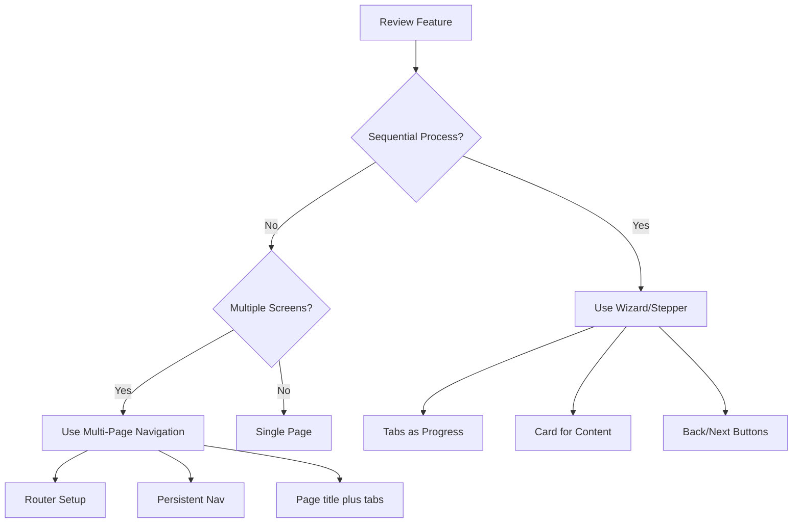

# Design Prototyping Workflow

This folder contains prototypes, design documentation, and reference materials for Workday Recruiting UI implementations.

## Local prototype entry URLs (dev server)

With **`npm run dev`** (port **5199**):

- **`http://localhost:5199/`** — default shell loads **WhatsApp omnichannel engagement v45**.
- **`http://localhost:5199/gcc-candidate-grid-v46`** — **Candidate grid redesign v46** (unified modal, hub tabs Requisitions / Candidates / Offers / Analytics).
- **`http://localhost:5199/gcc-candidate-grid-v46?mode=anonymised`** — same prototype in **anonymised review** mode (Works Council–style masking).
- Optional query flags (v46): **`empty=1`** (empty grid copy), **`gridError=1`** (grid error banner), **`cvError=1`** (CV error banner in modal). Combine with `&` as needed.
- Hash fallback: **`http://localhost:5199/#/gcc-candidate-grid-v46`**.

## Published previews (timestamped URLs)

CI can deploy each build to **GitHub / GHE Pages** under `preview/preview-<UTC>-<run_id>/`. Setup and URL rules: **[docs/gh-pages-preview.md](../docs/gh-pages-preview.md)**.

## Figma Design Reference

**Source**: [2-Way Email Recruiting](https://www.figma.com/design/HpAOHGAeXBORpHnyhsCMja/2-Way-Email_Recruiting_12_2024)

This Figma file contains the approved design system, UI patterns, and component styles for Workday Recruiting features.

### Capture this prototype to Figma (html-to-design MCP)

1. **Dev server** — from this folder run `npm run dev`. Vite is pinned to **`http://localhost:5199/`** (`strictPort: true` in `vite.config.ts`) so capture hash URLs always match the running app. On listen, the dev server **opens that URL in Google Chrome (new window) and Cursor’s Simple Browser** (see repo `scripts/open-url-chrome-and-cursor-browser.sh`). To skip: `VITE_NO_OPEN_BROWSERS=1 npm run dev`. If the server was **already running** when you opened the project (no fresh `listening` event), run **`npm run open:browsers`** from this folder to open both again.
2. **Figma `capture.js`** — On load, the script runs **`Kt()`**, which **reads `#figmacapture` from the URL** and starts its own automatic multi-capture flow. **`main.tsx` removes figma hash params synchronously** (before the script runs), then calls **`window.figma.captureForDesign({ captureId, endpoint, selector, delayMs })` exactly once** so only one submission runs per `captureId`. Non-figma hash keys (e.g. **`country=`**) are preserved. Default **`figmadelay` is 6000ms** when omitted. Default **`figmaselector`** is **`#figma-capture-root`**. After load, the address bar **no longer shows** `figmacapture` / `figmaendpoint` — that is expected. If the Figma file is **blank**, raise **`figmadelay`** (e.g. **`10000`**) and use a **new** `captureId` from MCP.
3. **Agent flow (Figma MCP only)** — Call **official Figma MCP** `generate_figma_design` (new file or existing file). Open the returned **`http://localhost:5199/#figmacapture=…&figmaendpoint=…`** URL **once** in a browser (e.g. macOS `open "http://localhost:5199/#figmacapture=…"`). Do not rely on any in-app paste UI — capture is driven entirely by **MCP + URL + `main.tsx`**. Poll MCP with the **`captureId`** until status is **`completed`**.
4. If port **5199** is already taken, stop the other process or temporarily change `vite.config.ts` and use the same port in the capture URL.

#### Fresh Figma file every run (no clipboard, no paste)

Html-to-design can **create a new Figma file automatically** on each capture. You only need to avoid reusing a spent `captureId`.

1. **MCP call** — In one shot, pass **`outputMode: "newFile"`**, a unique **`fileName`** (e.g. `GCC Nationalisation — 20 Mar 2026 — v2`), and your org **`planKey`**. Do **not** use **`clipboard`** unless you explicitly want “Copy instead” / paste-in-Figma.
2. **New id every time** — Before each capture, call **`generate_figma_design`** again. Each response includes a **new** `captureId` and hash URL. **Never** reuse yesterday’s link, refresh a tab that already submitted, or run `open` twice on the same hash.
3. **Open the new URL once** — Load the URL from **that** response only. `main.tsx` also listens for **`hashchange`**, so the agent can point the same tab at a **new** hash (new `captureId`) for a follow-up capture without a full reload.
4. **Poll** — Keep polling with the **`captureId`** from that same run until the MCP reports `completed`; the response should include the **new file** / claim URL.

You cannot get a new server-side file from an old `captureId`; “Capture already submitted” always means **request a new capture from MCP**, then use the **new** URL.

#### Troubleshooting: "Capture already submitted"

This message comes from **Figma’s html-to-design service**, not from a broken MCP install. Each **`captureId` is single-use**: the browser may only submit that id **once**. Typical causes:

- You **refreshed** the tab that had `#figmacapture=…` in the URL  
- You **opened the same hash URL twice**  
- An agent ran `open …#figmacapture=old-id` again after a successful submit  
- **Double submit**: Figma’s boot **`Kt()`** saw `#figmacapture` **and** the app also called **`captureForDesign`** (older builds). Current **`main.tsx`** strips figma params from the URL before **`capture.js`** executes so **`Kt()`** is a no-op; only **`captureForDesign`** runs.

**Fix:** In Cursor, ask the agent to call Figma MCP **`generate_figma_design`** again (same `outputMode` / file target) to get a **new** `captureId`, then open **`http://localhost:5199/#figmacapture=<new-id>&figmaendpoint=…`** **once**. Use MCP **polling** with the new id only — do not rely on reloading the browser to "retry".

#### Troubleshooting: new Figma file opens but looks **blank**

Html-to-design snapshots the DOM after a delay. This stack loads **Roboto from `design.workdaycdn.com`** (Canvas Kit fonts). If capture runs **before** fonts and layout settle, Figma can create a file with **empty or nearly empty** frames.

**Checks:**

- Dev server is **`npm run dev`** and you open the hash URL on **`http://localhost:5199/`** (not a stale build tab).
- Add **`&figmadelay=8000`** (or higher) to the hash URL for a slower machine or VPN.
- Open DevTools **Console**: you should see **`[figma capture] starting captureForDesign`** before the Figma **capturing** spinner and **Sent to Figma** bar appear. Older builds could **skip** `captureForDesign` when layout looked empty, which hid **all** Figma UI; current **`main.tsx`** waits up to **30s** for `#figma-capture-root` layout, then **always** calls `captureForDesign` so Figma can show its own UI or errors.
- Ensure **`capture.js`** is not blocked (privacy / corporate extension); the page must load `https://mcp.figma.com/mcp/html-to-design/capture.js`.
- **New `captureId` every attempt** — after a failed capture, call **`generate_figma_design`** again; do not reuse the same hash URL.

## Extracting Design Tokens

Before building a new prototype, extract design tokens and patterns from Figma to ensure visual consistency.

### Step 1: Get Figma Variables

Extract color, typography, and spacing tokens:

```typescript
CallMcpTool(
  server: "plugin-figma-figma",
  toolName: "get_variable_defs",
  arguments: { fileKey: "HpAOHGAeXBORpHnyhsCMja" }
)
```

### Step 2: Capture Reference Screens

Get design context from representative screens:

```typescript
CallMcpTool(
  server: "plugin-figma-figma",
  toolName: "get_design_context",
  arguments: { 
    fileKey: "HpAOHGAeXBORpHnyhsCMja",
    nodeId: "[specific-screen-node-id]",
    clientLanguages: "typescript",
    clientFrameworks: "react"
  }
)
```

**Note**: Replace `[specific-screen-node-id]` with actual node IDs from Figma. Extract node ID from Figma URLs (convert `-` to `:` in the `node-id` parameter).

### Step 3: Document in workday-design-tokens.md

Update [`workday-design-tokens.md`](./workday-design-tokens.md) with:
- Extracted color values
- Typography scale
- Spacing values
- UI pattern observations

### Step 4: Map to Canvas Kit

Map Figma design tokens to Canvas Kit equivalents:

| Figma Token | Canvas Kit Token | Usage |
|-------------|------------------|-------|
| Primary Blue | `colors.blueberry600` | Primary buttons, links |
| Secondary Blue | `colors.blueberry500` | Secondary actions |
| Success Green | `colors.greenApple600` | Success states |
| Error Red | `colors.cinnamon600` | Error states |
| Background Gray | `colors.soap100` | Page backgrounds |
| Border Gray | `colors.soap300` | Borders, dividers |

## Multi-Step Flow Decision Tree

When building prototypes, determine the appropriate flow pattern:



### Wizard/Stepper Flows

Use for: Job applications, onboarding, multi-step forms

**Key Components**:
- `Tabs` component for step indicators
- `Card` for step content
- `PrimaryButton` / `SecondaryButton` for navigation
- State management for current step

**Example**: Candidate application (Personal Info → Work History → Review)

### Multi-Page Navigation

Use for: Dashboard, list views, detail pages

**Key Components**:
- Persistent top navigation
- React Router or state-based routing
- Page **`Heading`** and hub / object **`Tabs`** for context — **do not** add Canvas Kit **`Breadcrumbs`** or chevron **path strips** anywhere under `design/` (workspace rule; PRDs cannot override)
- URL-based navigation

**Example**: Recruiter Hub (Dashboard → Candidates → Candidate Detail)

### Single Page

Use for: Simple forms, single actions, focused tasks

**Example**: Quick filter interface, single form submission

## Prototype Structure

```
design/
├── README.md                        # This file
├── components/                      # Shared shell: WorkdayTopNav, WorkdayLeftTabBar, CommunicationDock, SanaCommPanelPatterns, sanaShellTheme
├── workday-design-tokens.md         # Extracted Figma tokens
├── [feature]-prototype.tsx          # Prototype implementations
├── [feature]-implementation.md      # Implementation docs
└── node_modules/                    # Dependencies (gitignored)
```

**Shared Sana shell (full-page Recruiting prototypes):** import **`WorkdayTopNav`** and **`WorkdayLeftTabBar`** from `./components`, set the page background to **`SANA_PAGE_CANVAS`**, and follow **`010-style-guide.mdc`** and **`design/references/sana/`**. For **communication sliding panels** (Email, SMS, Notes, LINE, WhatsApp), use **`SanaCommComposer`**, **`SanaCommMessageBubble`**, **`sanaCommFormControlStyle`**, and **`communicationRailButtonStyle`** per **`Sana_Style_UI-candidate-profile-whatsapp-panel.png`**.

## Building a Prototype

### 1. Review PRD or Spec

Understand:
- User story and flow
- Required components
- States (loading, error, empty, success)
- Acceptance criteria

### 2. Extract Figma Reference

Follow extraction workflow above to get:
- Design tokens (colors, spacing, typography)
- UI patterns (navigation, cards, forms)
- Visual targets for fidelity

### 3. Choose Flow Pattern

Determine if prototype needs:
- Wizard/stepper flow
- Multi-page navigation
- Single page

### 4. Implement with Canvas Kit

Use Canvas Kit **v14.2.37** components (see [`CANVAS-KIT-VERSION.md`](./CANVAS-KIT-VERSION.md)):
- Layout: `Box`, `Flex`, `Card`
- Buttons: `PrimaryButton`, `SecondaryButton`, `TertiaryButton`
- Inputs: `TextInput`, `Select`, `FormField` + `FormField.Label` + `FormField.Input`, `Radio`, `Checkbox`
- Navigation: `Tabs`
- Text: `Heading`, `BodyText`
- Icons: `SystemIcon`

**Critical**: Ensure Canvas Tokens Web is installed and CSS is imported!

```tsx
// In main.tsx or index.tsx
import '@workday/canvas-tokens-web/css/base/_variables.css';
import '@workday/canvas-tokens-web/css/system/_variables.css';
import '@workday/canvas-tokens-web/css/brand/_variables.css';
```

### 5. Run Locally

Start dev server for capture to Figma:

```bash
npm run dev
# or
npm start
```

### 6. Document Implementation

Save to `[feature]-implementation.md` with:
- Component structure
- Canvas Kit components used
- States implemented
- Accessibility features
- Known issues

## Common UI Patterns

### Top Navigation

```tsx
<Box 
  paddingX="l" 
  paddingY="s" 
  style={{ 
    backgroundColor: 'white', 
    borderBottom: `1px solid ${colors.soap300}` 
  }}
>
  <Flex justifyContent="space-between" alignItems="center" gap="l">
    <Flex alignItems="center" gap="m">
      <ToolbarIconButton icon={justifyIcon} aria-label="Menu" />
      <Box style={{ fontSize: 24, fontWeight: 700, color: colors.blueberry500 }}>
        Workday
      </Box>
    </Flex>
    <Box flex="1 1 auto" maxWidth="600px">
      <TextInput placeholder="Search..." />
    </Box>
    <Avatar size={32} altText="User" />
  </Flex>
</Box>
```

### Card Container

```tsx
<Card padding="l" marginBottom="m">
  <Heading size="small" marginBottom="s">Card Title</Heading>
  <BodyText>Card content goes here.</BodyText>
</Card>
```

### Wizard Progress

```tsx
<Tabs initialTab="step1">
  <Tabs.List marginBottom="l">
    <Tabs.Item data-id="step1">Step 1</Tabs.Item>
    <Tabs.Item data-id="step2">Step 2</Tabs.Item>
    <Tabs.Item data-id="step3">Step 3</Tabs.Item>
  </Tabs.List>
  <Tabs.Panel data-id="step1">Step 1 content</Tabs.Panel>
  <Tabs.Panel data-id="step2">Step 2 content</Tabs.Panel>
  <Tabs.Panel data-id="step3">Step 3 content</Tabs.Panel>
</Tabs>
```

## Resources

- [Canvas Kit Storybook](https://workday.github.io/canvas-kit/) (cross-check with **v14** MCP resources)
- [Canvas Kit version pin](./CANVAS-KIT-VERSION.md)
- [Workday Design Tokens](./workday-design-tokens.md)
- [Figma Source File](https://www.figma.com/design/HpAOHGAeXBORpHnyhsCMja/)
- [320-prototype-developer Rule](../.cursor/rules/320-prototype-developer.mdc)

## Tips

- **Always extract tokens first** - Don't guess colors or spacing
- **Use Canvas Kit props** - Prefer `padding="l"` over inline styles
- **Test accessibility** - Keyboard navigation, screen readers, contrast
- **Match Figma fidelity** - Use Figma as visual target for styling
- **Document as you go** - Save implementation notes for handoff
- **Run locally** - Ensure prototype works before handoff to 330-figma-creator

## Questions?

See [320-prototype-developer rule](../.cursor/rules/320-prototype-developer.mdc) for detailed implementation guidance.
