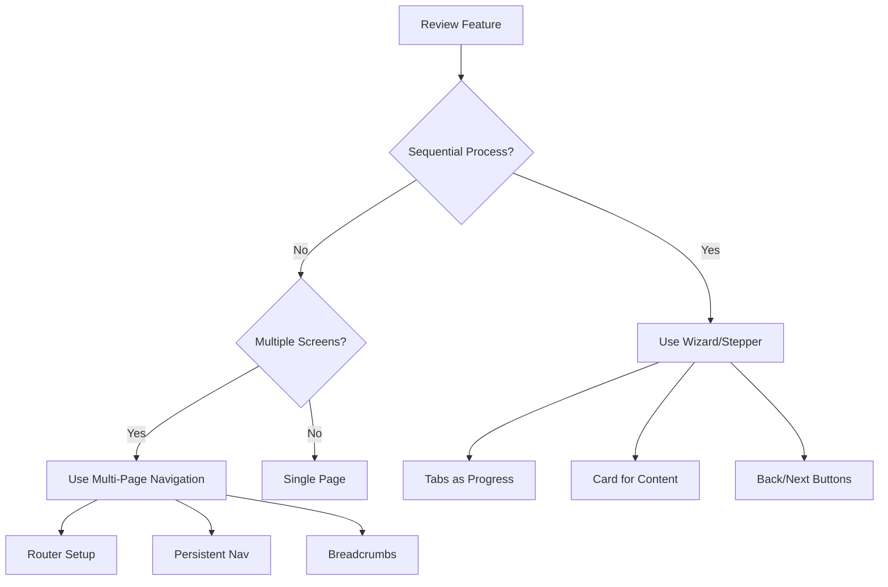

# Design Prototyping Workflow

This folder contains prototypes, design documentation, and reference materials for Workday Recruiting UI implementations.

## Figma Design Reference

**Source**: [2-Way Email Recruiting](https://www.figma.com/design/HpAOHGAeXBORpHnyhsCMja/2-Way-Email_Recruiting_12_2024)

This Figma file contains the approved design system, UI patterns, and component styles for Workday Recruiting features.

## Extracting Design Tokens

Before building a new prototype, extract design tokens and patterns from Figma to ensure visual consistency.

### Step 1: Get Figma Variables

Extract color, typography, and spacing tokens:

```typescript
CallMcpTool(
  server: "plugin-figma-figma",
  toolName: "get_variable_defs",
  arguments: { fileKey: "HpAOHGAeXBORpHnyhsCMja" }
)
```

### Step 2: Capture Reference Screens

Get design context from representative screens:

```typescript
CallMcpTool(
  server: "plugin-figma-figma",
  toolName: "get_design_context",
  arguments: { 
    fileKey: "HpAOHGAeXBORpHnyhsCMja",
    nodeId: "[specific-screen-node-id]",
    clientLanguages: "typescript",
    clientFrameworks: "react"
  }
)
```

**Note**: Replace `[specific-screen-node-id]` with actual node IDs from Figma. Extract node ID from Figma URLs (convert `-` to `:` in the `node-id` parameter).

### Step 3: Document in workday-design-tokens.md

Update [`workday-design-tokens.md`](./workday-design-tokens.md) with:
- Extracted color values
- Typography scale
- Spacing values
- UI pattern observations

### Step 4: Map to Canvas Kit

Map Figma design tokens to Canvas Kit equivalents:

| Figma Token | Canvas Kit Token | Usage |
|-------------|------------------|-------|
| Primary Blue | `colors.blueberry600` | Primary buttons, links |
| Secondary Blue | `colors.blueberry500` | Secondary actions |
| Success Green | `colors.greenApple600` | Success states |
| Error Red | `colors.cinnamon600` | Error states |
| Background Gray | `colors.soap100` | Page backgrounds |
| Border Gray | `colors.soap300` | Borders, dividers |

## Multi-Step Flow Decision Tree

When building prototypes, determine the appropriate flow pattern:



### Wizard/Stepper Flows

Use for: Job applications, onboarding, multi-step forms

**Key Components**:
- `Tabs` component for step indicators
- `Card` for step content
- `PrimaryButton` / `SecondaryButton` for navigation
- State management for current step

**Example**: Candidate application (Personal Info → Work History → Review)

### Multi-Page Navigation

Use for: Dashboard, list views, detail pages

**Key Components**:
- Persistent top navigation
- React Router or state-based routing
- Breadcrumb navigation
- URL-based navigation

**Example**: Recruiter Hub (Dashboard → Candidates → Candidate Detail)

### Single Page

Use for: Simple forms, single actions, focused tasks

**Example**: Quick filter interface, single form submission

## Prototype Structure

```
design/
├── README.md                        # This file
├── workday-design-tokens.md         # Extracted Figma tokens
├── [feature]-prototype.tsx          # Prototype implementations
├── [feature]-implementation.md      # Implementation docs
└── node_modules/                    # Dependencies (gitignored)
```

## Building a Prototype

### 1. Review PRD or Spec

Understand:
- User story and flow
- Required components
- States (loading, error, empty, success)
- Acceptance criteria

### 2. Extract Figma Reference

Follow extraction workflow above to get:
- Design tokens (colors, spacing, typography)
- UI patterns (navigation, cards, forms)
- Visual targets for fidelity

### 3. Choose Flow Pattern

Determine if prototype needs:
- Wizard/stepper flow
- Multi-page navigation
- Single page

### 4. Implement with Canvas Kit

Use Canvas Kit v11 components:
- Layout: `Box`, `Flex`, `Card`
- Buttons: `PrimaryButton`, `SecondaryButton`, `TertiaryButton`
- Inputs: `TextInput`, `Select`, `Radio`, `Checkbox`
- Navigation: `Tabs`
- Text: `Heading`, `BodyText`
- Icons: `SystemIcon`

**Critical**: Ensure Canvas Tokens Web is installed and CSS is imported!

```tsx
// In main.tsx or index.tsx
import '@workday/canvas-tokens-web/css/base/_variables.css';
import '@workday/canvas-tokens-web/css/system/_variables.css';
import '@workday/canvas-tokens-web/css/brand/_variables.css';
```

### 5. Run Locally

Start dev server for capture to Figma:

```bash
npm run dev
# or
npm start
```

### 6. Document Implementation

Save to `[feature]-implementation.md` with:
- Component structure
- Canvas Kit components used
- States implemented
- Accessibility features
- Known issues

## Common UI Patterns

### Top Navigation

```tsx
<Box 
  paddingX="l" 
  paddingY="s" 
  style={{ 
    backgroundColor: 'white', 
    borderBottom: `1px solid ${colors.soap300}` 
  }}
>
  <Flex justifyContent="space-between" alignItems="center" gap="l">
    <Flex alignItems="center" gap="m">
      <ToolbarIconButton icon={justifyIcon} aria-label="Menu" />
      <Box style={{ fontSize: 24, fontWeight: 700, color: colors.blueberry500 }}>
        Workday
      </Box>
    </Flex>
    <Box flex="1 1 auto" maxWidth="600px">
      <TextInput placeholder="Search..." />
    </Box>
    <Avatar size={32} altText="User" />
  </Flex>
</Box>
```

### Card Container

```tsx
<Card padding="l" marginBottom="m">
  <Heading size="small" marginBottom="s">Card Title</Heading>
  <BodyText>Card content goes here.</BodyText>
</Card>
```

### Wizard Progress

```tsx
<Tabs initialTab="step1">
  <Tabs.List marginBottom="l">
    <Tabs.Item data-id="step1">Step 1</Tabs.Item>
    <Tabs.Item data-id="step2">Step 2</Tabs.Item>
    <Tabs.Item data-id="step3">Step 3</Tabs.Item>
  </Tabs.List>
  <Tabs.Panel data-id="step1">Step 1 content</Tabs.Panel>
  <Tabs.Panel data-id="step2">Step 2 content</Tabs.Panel>
  <Tabs.Panel data-id="step3">Step 3 content</Tabs.Panel>
</Tabs>
```

## Resources

- [Canvas Kit v11 Documentation](https://workday.github.io/canvas-kit/) (via Canvas Kit MCP)
- [Workday Design Tokens](./workday-design-tokens.md)
- [Figma Source File](https://www.figma.com/design/HpAOHGAeXBORpHnyhsCMja/)
- [320-prototype-developer Rule](../.cursor/rules/320-prototype-developer.mdc)

## Tips

- **Always extract tokens first** - Don't guess colors or spacing
- **Use Canvas Kit props** - Prefer `padding="l"` over inline styles
- **Test accessibility** - Keyboard navigation, screen readers, contrast
- **Match Figma fidelity** - Use Figma as visual target for styling
- **Document as you go** - Save implementation notes for handoff
- **Run locally** - Ensure prototype works before handoff to 330-ux-designer

## Questions?

See [320-prototype-developer rule](../.cursor/rules/320-prototype-developer.mdc) for detailed implementation guidance.
