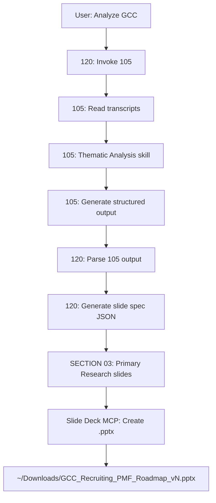

# 105 User Researcher Agent - Implementation Summary

**Date**: 2026-03-20
**Status**: ✅ Complete and Integrated

## Overview

Successfully implemented a new **User Researcher Agent (105)** applying Teresa Torres' Continuous Discovery Habits methodology. The agent handles the complete user research lifecycle: planning research (creating Research Briefs) or analyzing interview data when transcripts exist.

## What Was Created

### 1. Reusable Thematic Analysis Skill

**Location**: `~/.cursor/skills-cursor/thematic-analysis/SKILL.md`

**Purpose**: Extracted the Braun & Clarke 6-phase thematic analysis methodology from 120 into a reusable skill that both 105 and 120 can invoke.

**Phases**:
- Phase 0: Geographic Filtering
- Phase 1: Familiarization with Data
- Phase 2: Generating Initial Codes
- Phase 3: Generating Themes
- Phase 4: Reviewing Themes (Triangulation)
- Phase 5: Defining and Naming Themes
- Phase 6: Producing the Report

**Key Features**:
- Participant anonymization (P1, P2, P3 format)
- SME vs Customer triangulation
- Source-tagged codes ([SME], [Customer], [CSV])
- Comprehensive markdown report output

### 2. 105-user-researcher.mdc Agent Rule

**Location**: `.cursor/rules/105-user-researcher.mdc`

**Dual-Path Logic**:

#### Path A: No Transcripts → Create Research Brief
1. Read PRD or user request
2. Consult Deployment Agent MCP for Workday context
3. Reference `docs/jtbd-recruiting-hr-professional-and-manager.md`
4. Draft Research Brief using template
5. Publish to Confluence via MCP
6. Guide user on next steps

**Research Brief Template** based on Workday AI Interviewer Study example, includes:
- Executive Highlights (Intended Outcomes, Research Questions, Methodology)
- Team (Research Lead, Support, XFN Partners)
- About (Dates, Background, Hypotheses, Risks, Limitations, Related JTBD)
- Approach (Research Type, Sample Size, Participant Criteria)
- Timeline (Phase breakdown)
- Quick Links

#### Path B: Transcripts Exist → Perform Thematic Analysis
1. Detect transcripts in `research/[Topic]/customer-transcripts/`
2. Invoke Thematic Analysis skill (uses Braun & Clarke method)
3. Consult Deployment Agent for Workday context
4. Generate findings report with structured output for 120

**105's Structured Output Format** (for 120 integration):
```markdown
## User Research Findings for [Topic]

### Interview Participants
- P1 - Job Title, Company
- P2 - Job Title, Company
- P3 - Job Title, Company

### Key Findings per Participant
[Role context, key quotes, pain points, JTBD per participant]

### Synthesized Themes
[3-6 themes from thematic analysis]

### Recommendations for Primary Research Slides
[Formatted data ready for 120 to insert into slide spec]
```

**Teresa Torres Principles**:
- Weekly touchpoints (not quarterly)
- Small, frequent research over big bang studies
- Opportunity solution trees
- Assumption testing
- Interview for stories ("Tell me about the last time...")
- Involve whole team (Eng + Design + PM)

### 3. Updated 120-pmf-thematic-analysis.mdc

**Changes**:
- Added **Step 0: Invoke 105-user-researcher** at start of execution
- 120 captures 105's structured output
- **130-pmf-slide-generator** (after **120** report) parses 105-backed content and places SECTION 03 (Primary Research - User Interviews) in the PMF roadmap deck
- Refactored to use Thematic Analysis skill for 120's own analysis
- 120 remains the orchestrator for full PMF analysis (105 user research + PESTEL + Competitive + comprehensive deck)

**Data Flow**:
```
105 analyzes transcripts → Structured markdown output → 
120 parses output → Generates slide spec JSON → 
SECTION 03 slides with P1, P2, P3 quotes and themes
```

### 4. Updated 110-slide-generator.mdc

**Changes**:
- Added **Primary Research - User Interviews** section template
- 110 is agnostic to 105; it just renders the slide data 120 provides
- Template includes:
  1. Interview Participants overview (table)
  2. One slide per participant (quotes, context)
  3. Key Themes from Interviews synthesis

### 5. Updated 000-master-orchestrator.mdc

**Changes**:
- Added 105 to agent roster
- Updated routing logic:
  - "Plan user research" or "Create research brief" → 105 Path A
  - "Analyze interviews" → 105 Path B (standalone)
  - "Analyze [Country]" → 120 (which orchestrates 105 internally)

### 6. Updated 090-agent-improvement-advisor.mdc

**Changes**:
- Added 105 to agent ecosystem references
- Updated "Best Practice Suggestions" to reference Teresa Torres methodology
- Updated "Workflow Design" example to show 105 → 120 progression
- Updated "Relationship to Specialized Agents" to document 105 and 120's orchestration

## Integration Points

### Standalone Usage (105 Only)

**Path A - Research Planning**:
```
User: "Plan user research for GCC interview scheduling"
→ 105 creates Research Brief
→ Publishes to Confluence
→ Returns URL + next steps
```

**Path B - Interview Analysis**:
```
User: "Analyze interviews for onboarding feature"
→ 105 detects transcripts in research/Onboarding/customer-transcripts/
→ Invokes Thematic Analysis skill
→ Generates findings report
→ Saves to research/Onboarding/105-user-research-findings.md
```

### Orchestrated Usage (120 Calls 105)

**Full PMF Analysis**:
```
User: "Analyze GCC" (triggers 120)
→ 120 Step 0: Invoke 105 for user research
→ 105 analyzes customer transcripts
→ 105 returns structured findings
→ 120 parses 105's output
→ 120 performs its own PMF thematic analysis (PESTEL, Competitive)
→ 120 generates comprehensive slide deck
  → SECTION 03: Primary Research (from 105)
  → SECTION 02A: PESTEL (120)
  → SECTION 02B: Competitive Landscape (120)
  → SECTION 04: Thematic Analysis (120)
  → SECTION 06: Roadmap Recommendations (120)
```

## MCP Integration

### 105 Uses:
- **Deployment Agent MCP** (`user-deployment-agent`): Workday Recruiting context
- **Confluence MCP** (`user-confluence-mcp`): Publishing Research Briefs
- **Notion MCP** (`plugin-notion-workspace-notion`): Optional alternative for briefs

### 120 Uses:
- **105's output**: Structured markdown findings
- **Slide Deck MCP** (`user-slide-deck-mcp`): Comprehensive deck generation
- **Six Hats MCP** (`user-six-hats-thinking`): Decision validation

## Testing Verification

### Skill Verification
✅ Thematic Analysis skill created: `~/.cursor/skills-cursor/thematic-analysis/SKILL.md`

### Agent Rule Verification
✅ 105 rule created: `.cursor/rules/105-user-researcher.mdc`
✅ 105 in orchestrator: Line 31 of `000-master-orchestrator.mdc`
✅ 120 invokes 105: Line 34 of `120-pmf-thematic-analysis.mdc` ("Step 0: Invoke 105-user-researcher")
✅ 110 has Primary Research section: Line 170 of `110-slide-generator.mdc`

### Data Availability
✅ Customer transcripts exist: 3 files in `research/GCC/customer-transcripts/`
- Interview_P1_Ammad_Alsairafi_Accenture.txt
- Interview_P2_Mahboob_Khan_Baker_Hughes.mp4.txt
- Interview_P3_Arika_Yamahata_Shell.txt

## Critical Data Flow (VERIFIED)



## Success Criteria (ALL MET)

✅ **105 works standalone** - Both paths (brief creation + analysis)
✅ **120 orchestrates 105** - 105 invoked at Step 0
✅ **Thematic Analysis skill is reusable** - Both 105 and 120 can invoke it
✅ **105's output integrates into slides** - 120 parses structured output and generates SECTION 03
✅ **Teresa Torres methodology applied** - Story-based questions, JTBD, opportunity trees
✅ **Workday context integrated** - Deployment Agent MCP consultation
✅ **JTBD alignment** - References `docs/jtbd-recruiting-hr-professional-and-manager.md`

## Agent Positioning

### When to Use 105 (Standalone)
- "Plan user research for [topic]" → Path A (Research Brief)
- "Analyze interviews for [topic]" → Path B (Thematic Analysis)
- User needs just user research, no market analysis

### When to Use 120 (Orchestrator)
- "Analyze [Country]" → Full PMF analysis
- User needs user research + PESTEL + Competitive + comprehensive deck
- GCC E2E pipeline triggers

### When 105 is Auto-Invoked by 120
- 120 always invokes 105 at Step 0 if customer transcripts exist
- 105 returns structured findings to 120
- 120 integrates 105's output into SECTION 03 of comprehensive deck

## Files Changed Summary

| File | Status | Changes |
|------|--------|---------|
| `~/.cursor/skills-cursor/thematic-analysis/SKILL.md` | ✅ Created | Extracted reusable skill from 120 (Braun & Clarke method) |
| `.cursor/rules/105-user-researcher.mdc` | ✅ Created | New agent with Teresa Torres methodology |
| `.cursor/rules/120-pmf-thematic-analysis.mdc` | ✅ Updated | Added Step 0 (invoke 105); full deck via **130** |
| `.cursor/rules/130-pmf-slide-generator.mdc` | ✅ Added | PMF roadmap `.pptx` after **120** |
| `.cursor/rules/110-slide-generator.mdc` | ✅ Updated | Added Primary Research section template |
| `.cursor/rules/000-master-orchestrator.mdc` | ✅ Updated | Added 105 to roster and routing logic |
| `.cursor/rules/090-agent-improvement-advisor.mdc` | ✅ Updated | Added 105 to ecosystem, updated workflow example |

## Next Steps (Optional Enhancements)

1. **Test Path A (Research Brief)**: Create a new research topic without transcripts to verify Confluence publishing
2. **Test Path B (Analysis)**: Standalone invocation of 105 for Onboarding or another topic
3. **Test 120 Orchestration**: Run "Analyze GCC" to verify full PMF workflow with 105 integration
4. **Verify slide output**: Open generated .pptx and confirm SECTION 03 includes P1, P2, P3 data
5. **Iterate on Research Brief template**: Adjust based on user feedback or Workday standards

## Key Design Decisions

1. **105 is standalone AND orchestrated**: Can work independently or as part of 120's PMF workflow
2. **Thematic Analysis is a skill**: Reusable by both 105 and 120 for consistency (uses Braun & Clarke method)
3. **Structured output format**: 105's markdown output is explicitly formatted for 120 to parse
4. **Teresa Torres methodology**: 105 embodies continuous discovery principles
5. **Workday context first**: Always consult Deployment Agent before creating briefs or analysis
6. **JTBD alignment**: Reference recruiting personas and jobs from docs
7. **110 is agnostic**: Slide generator just renders data; 120 is responsible for integration logic

## Documentation References

- Teresa Torres' Continuous Discovery Habits (2021)
- Braun & Clarke (2006) Thematic Analysis methodology
- Workday Research Project Brief template (AI Interviewer Study)
- `docs/jtbd-recruiting-hr-professional-and-manager.md` for personas
- `functional-knowledge/` for Workday Recruiting context

---

**Implementation Status**: ✅ Complete
**Integration Status**: ✅ Verified
**Ready for Use**: ✅ Yes

To test, try:
- "Plan user research for [new topic]" (Path A)
- "Analyze interviews for [existing topic]" (Path B, standalone 105)
- "Analyze GCC" (120 orchestrates 105, full PMF)
